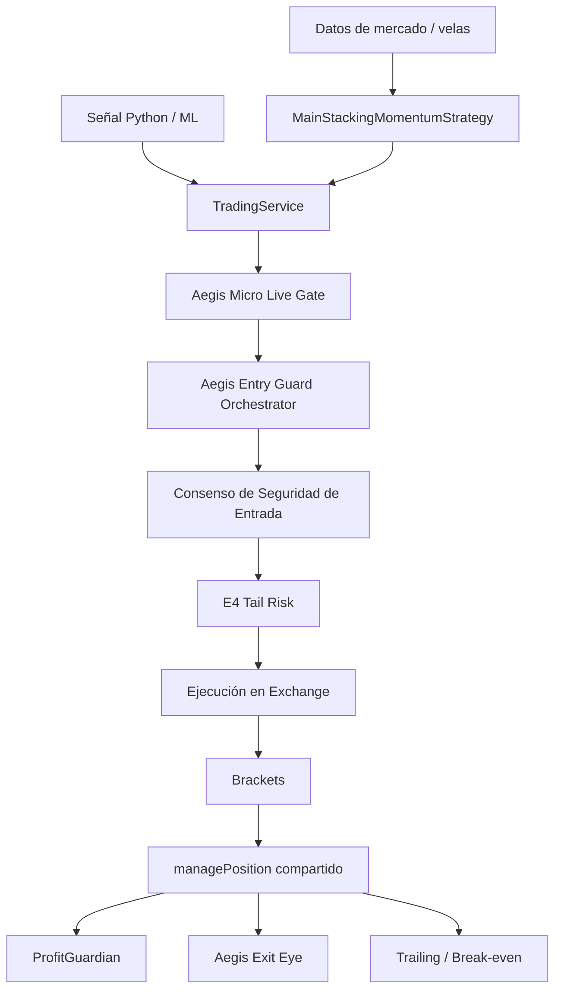
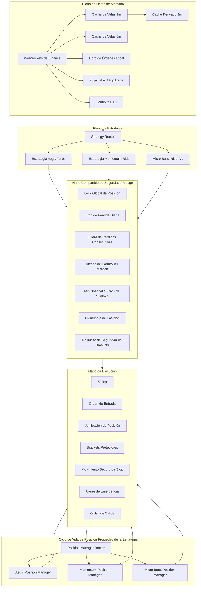
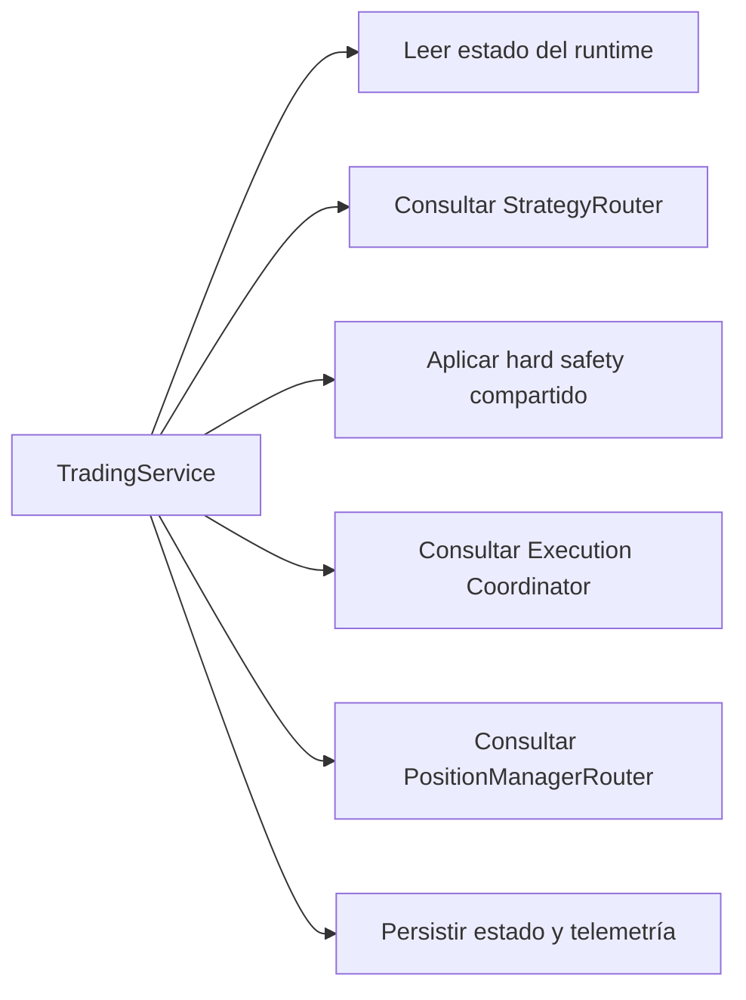
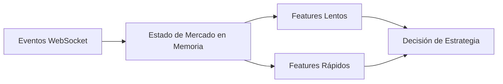
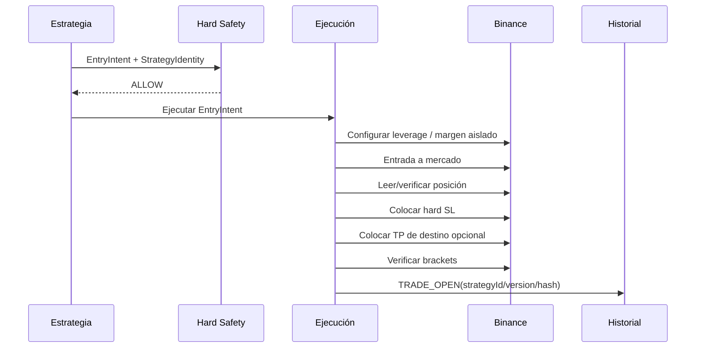
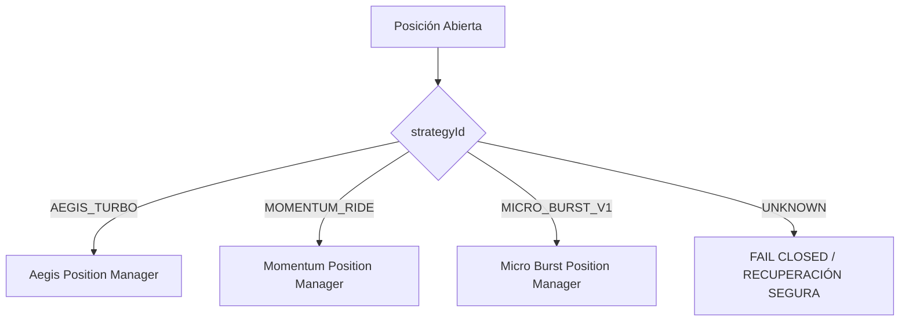
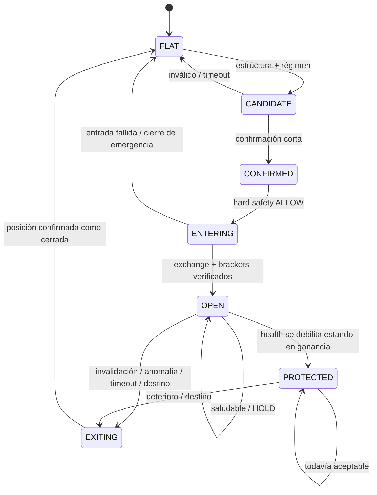

# Arquitectura del Runtime de Trading en TypeScript

> **Estado:** DISEÑO / SIN AUTORIDAD DE RUNTIME  
> **Rama:** `work/micro-burst-rider-v1-20260826`  
> **Rama padre:** `work/ts-multisymbol-momentum-20260826`  
> **Propósito:** definir la arquitectura objetivo antes de mover, eliminar o refactorizar código de runtime.

Este documento es el contrato arquitectónico para el runtime de trading en TypeScript. Describe intencionalmente tanto la forma actual del sistema como las fronteras objetivo que queremos introducir antes de implementar Micro Burst Rider V1.

Nada en este documento habilita trading, cambia el comportamiento del exchange, modifica configuración live ni autoriza una estrategia. El código de runtime permanece sin cambios hasta que una fase posterior de implementación sea aprobada explícitamente.

---

## 1. Objetivo arquitectónico

El bot debe dejar de tratar cada idea de trading como si fuera una señal de Aegis Turbo.

La arquitectura objetivo separa cuatro responsabilidades:

1. **Plano de Datos de Mercado** — recibe y mantiene el estado causal más reciente del mercado.
2. **Plano de Estrategia** — decide si una estrategia tiene un setup accionable y es dueño del ciclo de vida específico de esa estrategia.
3. **Plano de Seguridad / Riesgo** — aplica restricciones operativas no negociables e independientes del alpha de la estrategia.
4. **Plano de Ejecución** — interactúa con Binance, verifica posiciones, crea/reemplaza órdenes protectoras y cierra de forma segura.

La regla central es:

> **Una estrategia es dueña de su hipótesis de trading. El runtime compartido es dueño de la seguridad en el exchange.**

Aegis Turbo, Momentum Ride y Micro Burst deben poder coexistir sin fingir ser uno u otro y sin compartir accidentalmente lógica de salida específica de otra estrategia.

---

## 2. Línea base de la rama actual

La rama padre `work/ts-multisymbol-momentum-20260826` ya introdujo una capacidad importante: un detector de momentum standalone puede crear un candidato de entrada independientemente del cerebro Python/Aegis.

Sin embargo, la ruta actual de ejecución todavía reutiliza una cantidad importante de maquinaria específica de Aegis después de crear ese candidato. Conceptualmente, la forma actual es aproximadamente:



Esto nos da reutilización útil de infraestructura, pero no es la arquitectura objetivo para estrategias independientes.

---

## 3. Arquitectura objetivo de alto nivel



El strategy router decide **quién está autorizado a proponer una entrada**. El position manager router decide **quién es dueño del ciclo de vida de la operación abierta**.

Son decisiones separadas.

---

## 4. Invariante central: el ownership de la estrategia es inmutable por operación

Toda operación propiedad del bot debe transportar una identidad canónica de estrategia desde la creación de la entrada hasta el cierre final.

Ejemplo de identidad objetivo:

```ts
interface StrategyIdentity {
  strategyId: 'AEGIS_TURBO' | 'MOMENTUM_RIDE' | 'MICRO_BURST_V1';
  strategyVersion: string;
  strategyHash: string;
}
```

Una vez enviada una orden, `strategyId`, `strategyVersion` y `strategyHash` no pueden reescribirse silenciosamente.

La misma identidad debe aparecer en:

- estado del runtime;
- historial `TRADE_OPEN`;
- cada evento de decisión del ciclo de vida;
- eventos de brackets/protección;
- historial `TRADE_CLOSE`;
- exportaciones de métricas y análisis.

Una operación abierta por Momentum no debe registrarse después como Aegis Turbo. Una operación Micro Burst no debe heredar silenciosamente un lifecycle de Aegis simplemente porque se llamó un método compartido.

---

## 5. Fronteras objetivo del código fuente

Este es un **layout propuesto**, no una instrucción para mover archivos todavía.

```text
src/
├── app/
│   ├── services/
│   │   └── TradingService.ts
│   ├── strategy/
│   │   ├── StrategyRouter.ts
│   │   └── PositionManagerRouter.ts
│   └── execution/
│       └── TradingExecutionCoordinator.ts
│
├── domain/
│   ├── strategies/
│   │   ├── aegis-turbo/
│   │   │   ├── AegisTurboStrategy.ts
│   │   │   └── AegisTurboPositionManager.ts
│   │   ├── momentum-ride/
│   │   │   ├── MomentumRideStrategy.ts
│   │   │   └── MomentumRidePositionManager.ts
│   │   └── micro-burst/
│   │       ├── MicroBurstStrategy.ts
│   │       ├── MicroBurstRegime.ts
│   │       ├── MicroBurstStructure.ts
│   │       ├── MicroBurstMomentum.ts
│   │       ├── MicroBurstOrderBook.ts
│   │       ├── MicroBurstBtcContext.ts
│   │       ├── MicroBurstTradeHealth.ts
│   │       └── MicroBurstPositionManager.ts
│   │
│   ├── risk/
│   │   ├── GlobalPositionGuard.ts
│   │   ├── DailyLossGuard.ts
│   │   ├── PortfolioRiskGuard.ts
│   │   └── PositionOwnership.ts
│   │
│   └── execution/
│       ├── ProtectiveBracketPolicy.ts
│       └── SafeStopPolicy.ts
│
└── infra/
    ├── exchange/
    ├── market-data/
    │   ├── CandleCache.ts
    │   ├── MultiTimeframeCache.ts
    │   ├── LocalOrderBook.ts
    │   └── TradeFlowCache.ts
    ├── logging/
    └── config/
```

Los nombres finales de directorios pueden cambiar después. Lo importante es la frontera de ownership.

---

## 6. Responsabilidad objetivo de TradingService

`TradingService` debe convertirse gradualmente en un orquestador, en lugar de ser el lugar donde viven todas las reglas de todas las estrategias.

Responsabilidades objetivo:



`TradingService` eventualmente **no** debería contener:

- fórmulas de régimen de Micro Burst;
- fórmulas de patrones de Momentum;
- interpretación de alpha específica de Aegis;
- thresholds de salida específicos de estrategias;
- reglas de anomalía específicas de estrategias.

Puede coordinar estos módulos, pero no debe ser dueño de su lógica de negocio.

---

## 7. Plano de Datos de Mercado

Micro Burst es sensible a la latencia. El objetivo es un estado de mercado en memoria y dirigido por eventos.

### Estado lento / estructural

Actualizado principalmente a partir de velas completadas:

- velas completadas de 1m;
- velas completadas de 3m derivadas o nativas;
- velas completadas de 5m;
- estado de soporte/resistencia;
- estado ATR / volatilidad;
- estado de régimen;
- contexto estructural de BTC.

### Estado rápido / microestructura

Actualizado desde eventos WebSocket sin llamadas REST en la ruta caliente de decisión:

- mejor bid / ask;
- spread;
- imbalance de profundidad;
- niveles del libro de órdenes local;
- microprice;
- presión taker buy/sell;
- agotamiento / reposición de liquidez;
- aceleración de precio de horizonte corto.



### Regla de latencia

Una evaluación de estrategia no debe requerir descargar velas por REST en cada scan/tick.

REST sigue siendo válido para:

- bootstrap de arranque;
- recuperación de gaps;
- reconciliación;
- diagnósticos fuera de la ruta caliente.

---

## 8. Strategy Router

El router determina qué estrategia tiene actualmente autoridad de entrada.

Modos objetivo:

```ts
type StrategyMode = 'OFF' | 'SHADOW' | 'LIVE';
```

Ejemplo conceptual de configuración deseada:

```yaml
strategies:
  aegis_turbo:
    mode: OFF
  momentum_ride:
    mode: OFF
  micro_burst_v1:
    mode: SHADOW
```

Sólo las estrategias explícitamente en `LIVE` pueden solicitar ejecución.

Las estrategias `SHADOW` pueden calcular y registrar decisiones, pero no pueden mutar estado de posiciones/órdenes.

El router nunca debe convertir el candidato de una estrategia en el contrato de señal de otra estrategia únicamente para reutilizar código downstream.

---

## 9. Frontera compartida de hard safety

Hard safety no es alpha y puede compartirse.

Controles compartidos propuestos inicialmente:

- el símbolo está autorizado explícitamente;
- switch global/runtime de live;
- el modo de estrategia es `LIVE`;
- la conectividad/estado del exchange es saludable;
- el ownership de posición es conocido;
- regla global de una sola posición cuando esté configurada;
- máximo de trades / cooldown cuando esté configurado;
- stop de pérdida realizada diaria;
- circuit breaker de pérdidas consecutivas;
- exposición máxima de cuenta/margen;
- leverage válido y margen aislado;
- filtros de símbolo del exchange;
- notional mínimo;
- redondeo de cantidad/precio;
- hard stop protector obligatorio;
- verificación de colocación de brackets;
- fail closed si no se puede establecer protección obligatoria;
- cierre de emergencia después de un estado de entrada no verificado/inseguro.

Un filtro específico de una estrategia no debe disfrazarse como hard safety.

Ejemplos que **no son automáticamente hard safety compartido**:

- Aegis DecisionBrain;
- Aegis EntryQuality;
- Aegis CleanEntry;
- requisitos de patrón de Momentum Ride;
- Micro Burst TradeHealth;
- confirmación BTC específica de una estrategia;
- interpretación de régimen específica de una estrategia.

---

## 10. Plano de Ejecución

La capa de ejecución debe ser agnóstica a la estrategia.

Ejemplo de input:

```ts
interface EntryExecutionRequest {
  strategy: StrategyIdentity;
  symbol: string;
  side: 'LONG' | 'SHORT';
  leverage: number;
  requestedRisk: number;
  hardStopPrice: number;
  destinationPrice?: number;
  metadata: Record<string, unknown>;
}
```

El plano de ejecución es responsable de la corrección operativa, no de decidir si el setup de mercado es atractivo.

### Secuencia de entrada



### Principio de fallo

Si el runtime no puede verificar una posición abierta o establecer protección obligatoria, el sistema debe fallar cerrado e intentar un cierre de emergencia seguro.

---

## 11. Brackets protectores frente a salidas de estrategia

La arquitectura distingue entre **protección de desastre residente en el exchange** y **gestión activa propiedad de la estrategia**.

### Protección compartida en exchange

Toda estrategia live con apalancamiento normalmente debe tener un hard stop colocado en Binance inmediatamente después de la entrada y verificado.

Su propósito es sobrevivir si:

- Node se cae;
- desaparece la conectividad de red;
- WebSocket se congela;
- el position manager lanza una excepción;
- el estado del runtime deja de estar disponible.

### Ciclo de vida propiedad de la estrategia

La estrategia puede después:

- ajustar el stop;
- proteger ganancias;
- salir a mercado;
- salir en el destino;
- aplicar un mecanismo trailing específico de la estrategia.

Helpers compartidos como el reemplazo seguro de stop pueden reutilizarse. Las **reglas compartidas que deciden cuándo** mover el stop no pueden reutilizarse salvo que estén incluidas explícitamente en el contrato de la estrategia.

---

## 12. Position Manager Router

Después de verificar una entrada, la operación abierta debe enrutarse usando ownership inmutable de estrategia.



Ningún manager puede gestionar silenciosamente una posición propiedad de otra estrategia.

Ownership desconocido debe generar telemetría explícita y una ruta conservadora de recuperación.

---

## 13. Frontera del ciclo de vida de Micro Burst

Se espera que Micro Burst sea dueño de su hipótesis completa de trading:



Legacy Aegis Exit Eye y ProfitGuardian **no forman automáticamente parte de este lifecycle**.

Si se reutiliza algún helper existente, distinguimos:

- **reutilización de mecanismo:** permitida, p. ej. `safeMoveCloseStop`;
- **reutilización de política:** no permitida salvo que esté congelada explícitamente dentro del contrato de estrategia de Micro Burst.

---

## 14. Modo experimental global de una sola posición

Para Micro Burst V1, el objetivo de diseño inicial es una posición Micro Burst global, no una por símbolo.

Conceptualmente:

```text
MICRO_BURST_POSITION_OPEN = false -> scanning de entradas permitido
MICRO_BURST_POSITION_OPEN = true  -> todas las nuevas entradas Micro Burst bloqueadas
```

Esto reduce exposición solapada y hace que la evidencia temprana sea más fácil de atribuir.

Que otras estrategias puedan operar concurrentemente es una decisión de configuración separada. Durante el experimento inicial de Micro Burst, la configuración de investigación preferida es que Aegis Turbo y Momentum Ride no tengan autoridad de entrada live.

---

## 15. Modelo de estado y eventos

Toda decisión que cambie el ciclo de vida debe ser observable.

Familias mínimas de eventos:

```text
STRATEGY_CANDIDATE
STRATEGY_REJECTED
STRATEGY_CONFIRMED
HARD_SAFETY_DENIED
ENTRY_INTENT_CREATED
ORDER_SUBMITTED
POSITION_CONFIRMED
BRACKETS_CONFIRMED
POSITION_HEALTH
POSITION_PROTECTED
EXIT_INTENT_CREATED
TRADE_CLOSED
EMERGENCY_CLOSE_ATTEMPT
EMERGENCY_CLOSE_SUCCESS
EMERGENCY_CLOSE_FAILED
```

Cada evento derivado de estrategia debe contener:

```json
{
  "strategy_id": "MICRO_BURST_V1",
  "strategy_version": "...",
  "strategy_hash": "sha256:...",
  "decision_reason": "...",
  "input_timestamp": "...",
  "causal_data_watermark": "..."
}
```

El watermark causal existe para hacer posible demostrar qué información de mercado estaba disponible cuando se tomó la decisión.

---

## 16. Semántica de recuperación y reinicio

El reinicio del runtime nunca debe inferir ownership de estrategia a partir de la dirección actual del mercado.

Orden de recuperación:

1. inspeccionar posiciones del exchange;
2. leer estado/historial persistido del bot;
3. establecer identidad de ownership;
4. verificar órdenes protectoras;
5. enrutar al position manager correcto;
6. si no se puede establecer ownership, entrar en un modo explícito de recuperación en vez de asignar una estrategia arbitraria.

Las posiciones manuales/externas permanecen distintas de las posiciones verificadas propiedad del bot.

---

## 17. Requisitos de reproducibilidad científica

Cada revisión de estrategia debe poder atribuirse a una definición inmutable.

Una operación no es reproducible si sólo sabemos:

```text
strategy = MICRO_BURST
```

Necesitamos:

```text
strategy_id
strategy_version
strategy_hash
config_hash
code_commit_sha
market_data timestamps
```

El contrato detallado de hash de estrategia está definido en [`STRATEGY_CONTRACTS.md`](./STRATEGY_CONTRACTS.md).

---

## 18. Lo que esta arquitectura evita deliberadamente

No queremos:

```text
Estrategia A
   -> falsificar señal de Estrategia B
   -> pasar por guards de Estrategia B
   -> usar exit manager de Estrategia B
   -> registrar operación bajo Estrategia B
```

Queremos:

```text
Estrategia A
   -> decisión de Estrategia A
   -> hard safety común
   -> mecanismo de ejecución común
   -> position manager de Estrategia A
   -> atribución a Estrategia A
```

Esta separación es el principal objetivo arquitectónico de la rama.

---

## 19. Orden de migración planeado

Este documento **no** autoriza la migración. Cuando la implementación sea aprobada, el orden de bajo riesgo previsto es:

1. introducir `StrategyIdentity` sin cambiar comportamiento;
2. corregir atribución de estrategia en historial de apertura/cierre;
3. introducir `StrategyRouter` como capa de compatibilidad;
4. introducir `PositionManagerRouter` mientras todo el tráfico existente continúa enrutándose al comportamiento legacy;
5. extraer mecanismos compartidos de hard safety/ejecución sin cambiar su semántica;
6. agregar Micro Burst en modo `OFF`;
7. agregar telemetría shadow determinista;
8. agregar caches de market data necesarias para 1m/3m/5m y microestructura;
9. probar aislamiento entre estrategias;
10. sólo después de evidencia y aprobación explícita considerar autoridad live.

Cada paso de migración debe seguir siendo revertible de manera independiente.

---

## 20. No-objetivos de la fase actual de documentación

Esta fase **no**:

- mueve archivos existentes;
- elimina archivos existentes;
- renombra clases de runtime;
- cambia `TradingService`;
- cambia adaptadores de Binance;
- cambia brackets;
- cambia leverage;
- habilita Micro Burst;
- deshabilita estrategias actuales en configuración live;
- altera E4;
- altera Aegis Entry Policy;
- altera comportamiento de Momentum Ride;
- agrega suscripciones al libro de órdenes;
- agrega nuevas dependencias.

Esas decisiones deben discutirse después de revisar esta arquitectura.

---

## 21. Checklist de revisión arquitectónica

Antes de comenzar la implementación, debemos acordar explícitamente:

- IDs finales de estrategias;
- qué controles son realmente hard safety compartido;
- si E4 permanece exclusivo de Aegis o se convierte en un servicio compartido de seguridad para estrategias seleccionadas;
- si una sola posición global significa todas las estrategias o únicamente Micro Burst;
- si el TP de destino es obligatorio u opcional para Micro Burst;
- con qué frecuencia evalúa el TradeHealth rápido;
- feeds exactos de market data para order book y taker flow;
- comportamiento de recuperación para ownership desconocido;
- directorios finales del código;
- implementación del manifest de hashes y verificación en CI.

Hasta que estas decisiones se tomen, este documento permanece como una propuesta arquitectónica con **SIN AUTORIDAD DE RUNTIME**.
