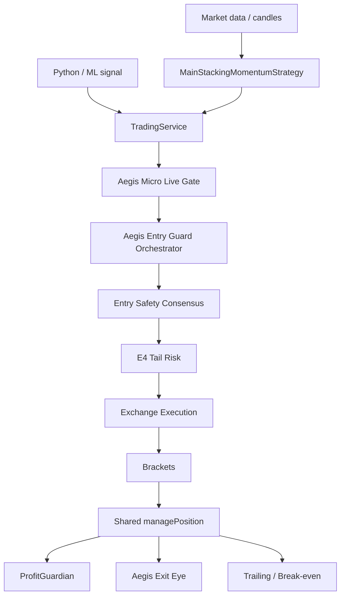
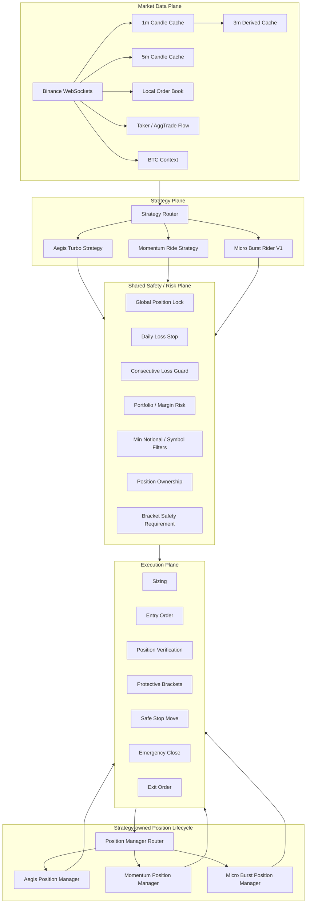
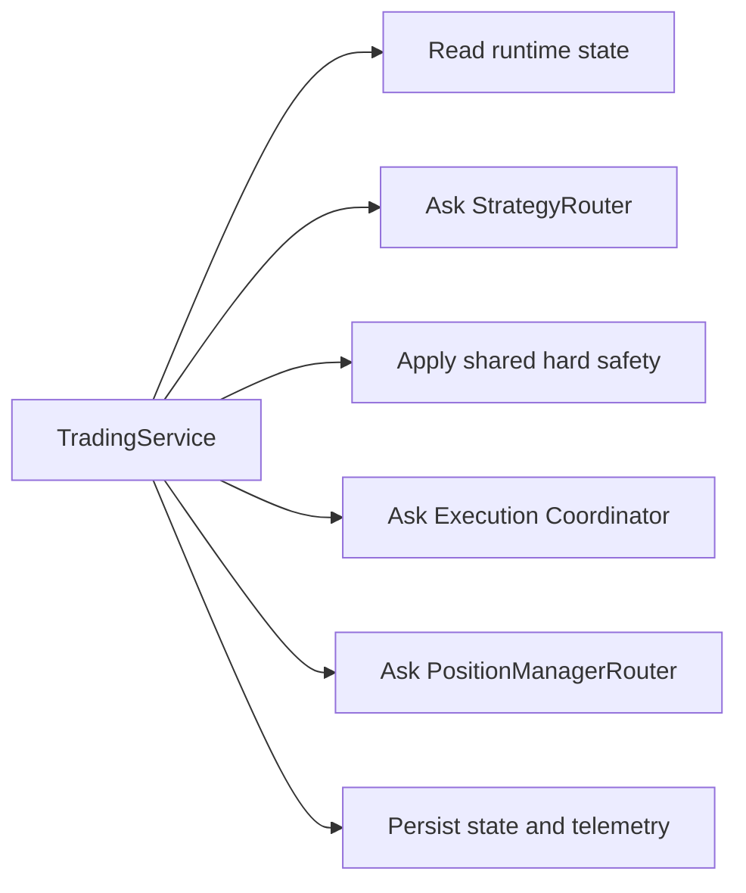
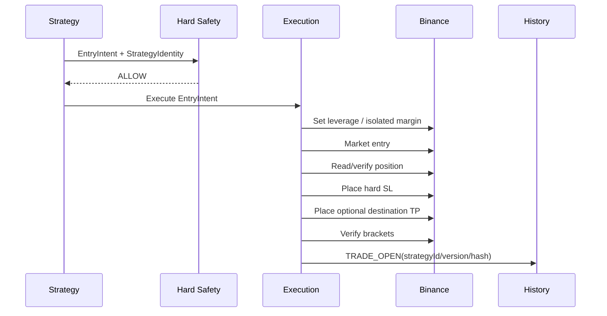
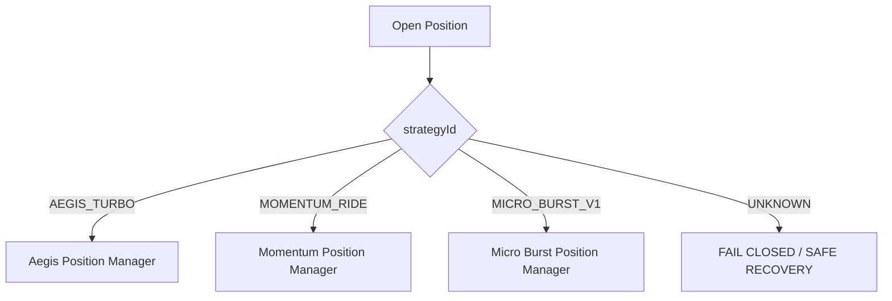
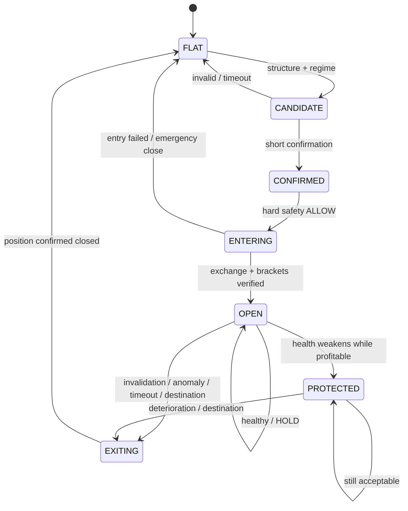

# TypeScript Trading Runtime Architecture

> **Status:** DESIGN / NO RUNTIME AUTHORITY  
> **Branch:** `work/micro-burst-rider-v1-20260826`  
> **Parent branch:** `work/ts-multisymbol-momentum-20260826`  
> **Purpose:** define the target architecture before moving, deleting, or refactoring runtime code.

This document is the architectural contract for the TypeScript trading runtime. It intentionally describes both the current shape of the system and the target boundaries we want to introduce before implementing Micro Burst Rider V1.

Nothing in this document enables trading, changes exchange behavior, modifies live configuration, or authorizes a strategy. Runtime code remains unchanged until a later implementation phase is explicitly approved.

---

## 1. Architectural objective

The bot must stop treating every trading idea as if it were an Aegis Turbo signal.

The target architecture separates four concerns:

1. **Market Data Plane** — receives and maintains the freshest causal market state.
2. **Strategy Plane** — decides whether a strategy has an actionable setup and owns the strategy-specific lifecycle.
3. **Safety / Risk Plane** — applies non-negotiable operational constraints independent of strategy alpha.
4. **Execution Plane** — interacts with Binance, verifies positions, creates/replaces protective orders, and closes safely.

The central rule is:

> **A strategy owns its trading hypothesis. The shared runtime owns exchange safety.**

Aegis Turbo, Momentum Ride, and Micro Burst must be able to coexist without pretending to be each other and without sharing strategy-specific exit logic accidentally.

---

## 2. Current branch baseline

The parent branch `work/ts-multisymbol-momentum-20260826` already introduced an important capability: a standalone momentum detector can create an entry candidate independently of the Python/Aegis brain.

However, the current execution path still reuses substantial Aegis-specific machinery after that candidate is created. Conceptually, the current shape is approximately:



This gives us useful infrastructure reuse, but it is not the target architecture for independent strategies.

---

## 3. Target high-level architecture



The strategy router chooses **who is allowed to propose an entry**. The position manager router chooses **who owns the open trade lifecycle**.

These are separate decisions.

---

## 4. Core invariant: strategy ownership is immutable per trade

Every bot-owned trade must carry a canonical strategy identity from entry creation until final close.

Example target identity:

```ts
interface StrategyIdentity {
  strategyId: 'AEGIS_TURBO' | 'MOMENTUM_RIDE' | 'MICRO_BURST_V1';
  strategyVersion: string;
  strategyHash: string;
}
```

Once an order is submitted, `strategyId`, `strategyVersion`, and `strategyHash` may not be silently rewritten.

The same identity must appear in:

- runtime state;
- `TRADE_OPEN` history;
- every lifecycle decision event;
- bracket/protection events;
- `TRADE_CLOSE` history;
- metrics and analytics exports.

A trade opened by Momentum must not later be recorded as Aegis Turbo. A Micro Burst trade must not silently inherit an Aegis lifecycle because a shared method happens to be called.

---

## 5. Target source-code boundaries

This is a **proposed layout**, not an instruction to move files yet.

```text
src/
├── app/
│   ├── services/
│   │   └── TradingService.ts
│   ├── strategy/
│   │   ├── StrategyRouter.ts
│   │   └── PositionManagerRouter.ts
│   └── execution/
│       └── TradingExecutionCoordinator.ts
│
├── domain/
│   ├── strategies/
│   │   ├── aegis-turbo/
│   │   │   ├── AegisTurboStrategy.ts
│   │   │   └── AegisTurboPositionManager.ts
│   │   ├── momentum-ride/
│   │   │   ├── MomentumRideStrategy.ts
│   │   │   └── MomentumRidePositionManager.ts
│   │   └── micro-burst/
│   │       ├── MicroBurstStrategy.ts
│   │       ├── MicroBurstRegime.ts
│   │       ├── MicroBurstStructure.ts
│   │       ├── MicroBurstMomentum.ts
│   │       ├── MicroBurstOrderBook.ts
│   │       ├── MicroBurstBtcContext.ts
│   │       ├── MicroBurstTradeHealth.ts
│   │       └── MicroBurstPositionManager.ts
│   │
│   ├── risk/
│   │   ├── GlobalPositionGuard.ts
│   │   ├── DailyLossGuard.ts
│   │   ├── PortfolioRiskGuard.ts
│   │   └── PositionOwnership.ts
│   │
│   └── execution/
│       ├── ProtectiveBracketPolicy.ts
│       └── SafeStopPolicy.ts
│
└── infra/
    ├── exchange/
    ├── market-data/
    │   ├── CandleCache.ts
    │   ├── MultiTimeframeCache.ts
    │   ├── LocalOrderBook.ts
    │   └── TradeFlowCache.ts
    ├── logging/
    └── config/
```

The final directory names can change later. The important part is the ownership boundary.

---

## 6. TradingService target responsibility

`TradingService` should gradually become an orchestrator rather than the place where every strategy rule lives.

Target responsibilities:



`TradingService` should **not** eventually contain:

- Micro Burst regime formulas;
- Momentum pattern formulas;
- Aegis-specific alpha interpretation;
- strategy-specific exit thresholds;
- strategy-specific anomaly rules.

It may coordinate these modules but should not own their business logic.

---

## 7. Market Data Plane

Micro Burst is sensitive to latency. The target is an event-driven in-memory market state.

### Slow / structural state

Updated primarily from completed candles:

- 1m completed candles;
- derived or native 3m completed candles;
- 5m completed candles;
- support/resistance state;
- ATR / volatility state;
- regime state;
- BTC structural context.

### Fast / microstructure state

Updated from WebSocket events without REST calls in the hot decision path:

- best bid / ask;
- spread;
- depth imbalance;
- local order-book levels;
- microprice;
- taker buy/sell pressure;
- liquidity depletion / replenishment;
- short-horizon price acceleration.


### Latency rule

A strategy evaluation must not require a REST candle download on every scan/tick.

REST remains valid for:

- startup bootstrap;
- gap recovery;
- reconciliation;
- non-hot-path diagnostics.

---

## 8. Strategy Router

The router determines which strategy currently has entry authority.

Target modes:

```ts
type StrategyMode = 'OFF' | 'SHADOW' | 'LIVE';
```

Example desired configuration concept:

```yaml
strategies:
  aegis_turbo:
    mode: OFF
  momentum_ride:
    mode: OFF
  micro_burst_v1:
    mode: SHADOW
```

Only strategies explicitly in `LIVE` may request execution.

`SHADOW` strategies may calculate and log decisions but may not mutate position/order state.

The router must never convert one strategy's candidate into another strategy's signal contract solely to reuse downstream code.

---

## 9. Shared hard-safety boundary

Hard safety is not alpha and may be shared.

Initial proposed shared controls:

- symbol is explicitly authorized;
- global/runtime live switch;
- strategy mode is `LIVE`;
- exchange connectivity/state is healthy;
- position ownership is known;
- global single-position rule when configured;
- max trades / cooldown where configured;
- daily realized-loss stop;
- consecutive-loss circuit breaker;
- maximum account/margin exposure;
- valid leverage and isolated margin;
- exchange symbol filters;
- minimum notional;
- quantity/price rounding;
- hard protective stop required;
- bracket placement verification;
- fail closed if mandatory protection cannot be established;
- emergency close after unverified/unsafe entry state.

A strategy-specific filter must not be disguised as hard safety.

Examples that are **not automatically shared hard safety**:

- Aegis DecisionBrain;
- Aegis EntryQuality;
- Aegis CleanEntry;
- Momentum Ride pattern requirements;
- Micro Burst TradeHealth;
- strategy-specific BTC confirmation;
- strategy-specific regime interpretation.

---

## 10. Execution Plane

The execution layer must be strategy-agnostic.

Input example:

```ts
interface EntryExecutionRequest {
  strategy: StrategyIdentity;
  symbol: string;
  side: 'LONG' | 'SHORT';
  leverage: number;
  requestedRisk: number;
  hardStopPrice: number;
  destinationPrice?: number;
  metadata: Record<string, unknown>;
}
```

The execution plane is responsible for operational correctness, not for deciding whether the market setup is attractive.

### Entry sequence



### Failure principle

If the runtime cannot verify an opened position or establish mandatory protection, the system must fail closed and attempt a safe emergency close.

---

## 11. Protective brackets versus strategy exits

The architecture distinguishes **exchange-resident disaster protection** from **strategy-owned active management**.

### Shared exchange protection

Every leveraged live strategy should normally have a hard stop placed at Binance immediately after entry and verified.

Its purpose is survival if:

- Node crashes;
- network connectivity disappears;
- WebSocket freezes;
- position manager throws;
- runtime state becomes unavailable.

### Strategy-owned lifecycle

The strategy may later:

- tighten the stop;
- protect profit;
- exit at market;
- exit at destination;
- apply a strategy-specific trailing mechanism.

Shared helpers such as safe stop replacement may be reused. Shared **rules deciding when** to move the stop may not be reused unless explicitly included in the strategy contract.

---

## 12. Position Manager Router

After an entry is verified, the open trade must be routed using immutable strategy ownership.



No manager may silently manage a position owned by another strategy.

Unknown ownership must generate explicit telemetry and a conservative recovery path.

---

## 13. Micro Burst lifecycle boundary

Micro Burst is expected to own its complete trading hypothesis:



Legacy Aegis Exit Eye and ProfitGuardian are **not automatically part of this lifecycle**.

If any existing helper is reused, we distinguish:

- **mechanism reuse:** allowed, e.g. `safeMoveCloseStop`;
- **policy reuse:** not allowed unless explicitly frozen into Micro Burst's strategy contract.

---

## 14. Global single-position experiment mode

For Micro Burst V1, the initial design target is one Micro Burst position globally, not one per symbol.

Conceptually:

```text
MICRO_BURST_POSITION_OPEN = false -> entry scanning allowed
MICRO_BURST_POSITION_OPEN = true  -> all new Micro Burst entries blocked
```

This reduces overlapping exposure and makes early evidence easier to attribute.

Whether other strategies may trade concurrently is a separate configuration decision. During the initial Micro Burst experiment the preferred research configuration is that Aegis Turbo and Momentum Ride have no live entry authority.

---

## 15. State and event model

Every lifecycle-changing decision should be observable.

Minimum event families:

```text
STRATEGY_CANDIDATE
STRATEGY_REJECTED
STRATEGY_CONFIRMED
HARD_SAFETY_DENIED
ENTRY_INTENT_CREATED
ORDER_SUBMITTED
POSITION_CONFIRMED
BRACKETS_CONFIRMED
POSITION_HEALTH
POSITION_PROTECTED
EXIT_INTENT_CREATED
TRADE_CLOSED
EMERGENCY_CLOSE_ATTEMPT
EMERGENCY_CLOSE_SUCCESS
EMERGENCY_CLOSE_FAILED
```

Each strategy-derived event should contain:

```json
{
  "strategy_id": "MICRO_BURST_V1",
  "strategy_version": "...",
  "strategy_hash": "sha256:...",
  "decision_reason": "...",
  "input_timestamp": "...",
  "causal_data_watermark": "..."
}
```

The causal watermark exists to make it possible to prove what market information was available when the decision was made.

---

## 16. Recovery and restart semantics

Runtime restart must never infer strategy ownership from current market direction.

Recovery order:

1. inspect exchange positions;
2. read persisted bot state/history;
3. establish ownership identity;
4. verify protective orders;
5. route to the correct position manager;
6. if ownership cannot be established, enter explicit recovery mode rather than assigning an arbitrary strategy.

Manual/external positions remain distinct from verified bot-owned positions.

---

## 17. Scientific reproducibility requirements

Every strategy revision must be attributable to an immutable definition.

A trade is not reproducible if we know only:

```text
strategy = MICRO_BURST
```

We need:

```text
strategy_id
strategy_version
strategy_hash
config_hash
code_commit_sha
market_data timestamps
```

The detailed strategy hash contract is defined in [`STRATEGY_CONTRACTS.md`](./STRATEGY_CONTRACTS.md).

---

## 18. What this architecture deliberately avoids

We do not want:

```text
Strategy A
   -> forge Strategy B signal
   -> pass through Strategy B guards
   -> use Strategy B exit manager
   -> record trade under Strategy B
```

We want:

```text
Strategy A
   -> Strategy A decision
   -> common hard safety
   -> common execution mechanism
   -> Strategy A position manager
   -> Strategy A attribution
```

This separation is the principal architectural objective of the branch.

---

## 19. Planned migration order

This document does **not** authorize the migration. When implementation is approved, the intended low-risk order is:

1. introduce `StrategyIdentity` without changing behavior;
2. fix strategy attribution in trade-open/trade-close history;
3. introduce `StrategyRouter` as a compatibility layer;
4. introduce `PositionManagerRouter` while routing all existing traffic to legacy behavior;
5. extract shared hard-safety/execution mechanisms without changing their semantics;
6. add Micro Burst in `OFF` mode;
7. add deterministic shadow telemetry;
8. add market-data caches needed for 1m/3m/5m and microstructure;
9. test strategy isolation;
10. only after evidence and explicit approval consider live authority.

Every migration step should remain independently revertible.

---

## 20. Non-goals of the current documentation phase

This phase does **not**:

- move existing files;
- delete existing files;
- rename runtime classes;
- change `TradingService`;
- change Binance adapters;
- change brackets;
- change leverage;
- enable Micro Burst;
- disable current strategies in live config;
- alter E4;
- alter Aegis Entry Policy;
- alter Momentum Ride behavior;
- add order-book subscriptions;
- add new dependencies.

Those choices must be discussed after reviewing this architecture.

---

## 21. Architecture review checklist

Before implementation begins, we should explicitly agree on:

- final strategy IDs;
- which controls are truly shared hard safety;
- whether E4 remains Aegis-only or becomes a shared safety service for selected strategies;
- whether global single-position means all strategies or Micro Burst only;
- whether destination TP is mandatory or optional for Micro Burst;
- how often fast TradeHealth evaluates;
- exact market-data feeds for order-book and taker flow;
- recovery behavior for unknown ownership;
- final code directories;
- hash-manifest implementation and CI verification.

Until those decisions are made, this document remains an architectural proposal with **NO RUNTIME AUTHORITY**.
