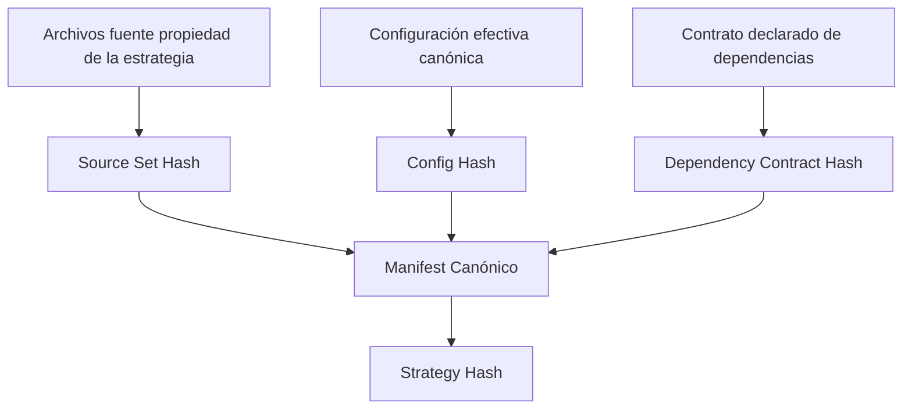
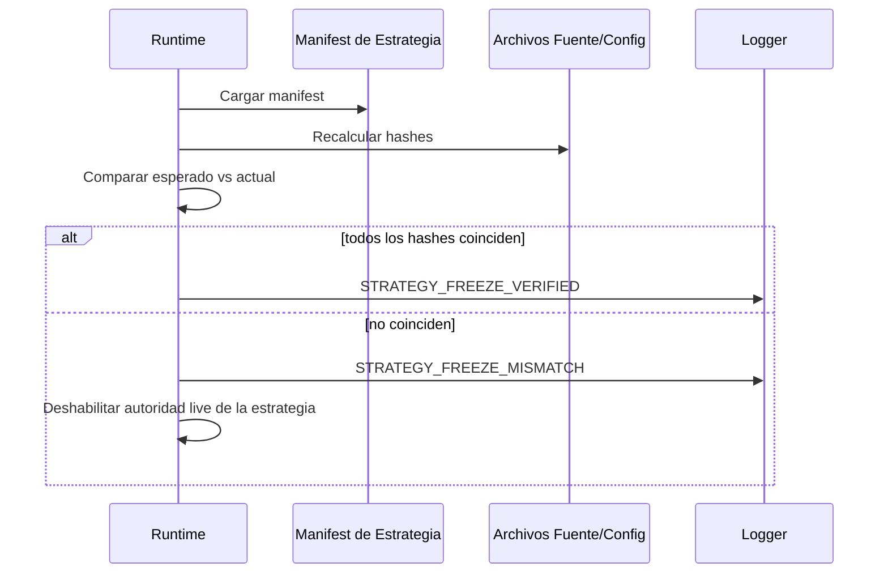
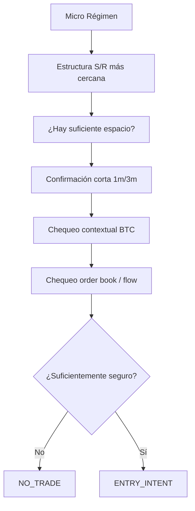

# Contratos de Comportamiento de Estrategias y Congelamiento por Hash

> **Estado:** DISEÑO / SIN AUTORIDAD DE RUNTIME  
> **Rama:** `work/micro-burst-rider-v1-20260826`  
> **Propósito:** definir cómo se comporta cada estrategia, qué posee, qué puede compartir y cómo una revisión inmutable de estrategia será congelada e identificada.

Este documento está separado intencionalmente de la arquitectura general del runtime. La arquitectura describe **cómo está organizado el bot**. Este archivo describe **qué puede hacer cada estrategia** y cómo ese comportamiento se vuelve reproducible mediante hashes versionados.

Ninguna estrategia queda congelada sólo por aparecer en este documento. Una estrategia se considera congelada únicamente después de que exista un manifest canónico, todos los artefactos fuente/config referenciados estén finalizados, se calculen los hashes requeridos y el contrato resultante quede comprometido en Git.

---

## 1. Principios del contrato de estrategia

Toda estrategia con capacidad potencial de operar live debe tener un contrato completo que cubra:

1. identidad;
2. inputs de datos;
3. hipótesis de entrada;
4. interpretación de régimen;
5. dependencias de hard safety;
6. autoridad de sizing de posición;
7. política de brackets;
8. ciclo de vida de posición abierta;
9. autoridad de salida;
10. comportamiento máximo de permanencia;
11. comportamiento de estado/reinicio;
12. telemetría;
13. artefactos fuente/config congelados;
14. hashes canónicos.

Una estrategia puede reutilizar un **mecanismo** sin reutilizar la **política de decisión** de otra estrategia.

Ejemplo:

```text
safeMoveCloseStop()      = mecanismo, puede compartirse
"mover a BE en +8% ROE" = política, pertenece al contrato de una estrategia
```

---

## 2. Identidad canónica de estrategia

Identidad objetivo en runtime:

```ts
interface StrategyIdentity {
  strategyId: string;
  strategyVersion: string;
  strategyHash: string;
  configHash: string;
  codeCommitSha: string;
}
```

### Semántica requerida

`strategyId`
: identificador estable de familia, por ejemplo `AEGIS_TURBO`, `MOMENTUM_RIDE`, `MICRO_BURST_V1`.

`strategyVersion`
: etiqueta inmutable y legible por humanos de la revisión, por ejemplo `1.0.0-frozen-2026-09-01`.

`strategyHash`
: huella SHA-256 del manifest canónico de estrategia y de todos los artefactos congelados propiedad de esa estrategia.

`configHash`
: huella SHA-256 de la configuración efectiva canónica de la estrategia después de normalización determinista.

`codeCommitSha`
: SHA del commit del repositorio que contiene la implementación exacta utilizada.

Un evento de runtime con un hash requerido de estrategia desconocido, ausente o que no coincida no debe afirmar que pertenece a una operación de estrategia congelada.

---

## 3. Estados de congelamiento

Cada revisión de estrategia debe estar explícitamente en uno de estos estados:

```text
DRAFT
SHADOW_CANDIDATE
FROZEN_SHADOW
FROZEN_LIVE_CANDIDATE
FROZEN_LIVE
RETIRED
INVALIDATED
```

Significado:

- `DRAFT`: el comportamiento puede cambiar libremente; sin autoridad de evidencia.
- `SHADOW_CANDIDATE`: estructuralmente lista para observación, pero todavía no congelada.
- `FROZEN_SHADOW`: comportamiento exacto congelado para evidencia prospectiva en shadow.
- `FROZEN_LIVE_CANDIDATE`: la evidencia shadow superó gates predefinidos, pero live todavía requiere promoción explícita.
- `FROZEN_LIVE`: revisión exacta congelada autorizada para operar bajo configuración aprobada.
- `RETIRED`: preservada para historial, pero sin nueva autoridad.
- `INVALIDATED`: el contrato/evidencia resultó defectuoso; sin autoridad.

La promoción a live nunca cambia el strategy hash. Si cambia el comportamiento, se trata de una nueva revisión de estrategia y, por tanto, de un nuevo hash.

---

## 4. Manifest canónico

Cada revisión congelada eventualmente debería tener un manifest legible por máquina como:

```text
strategy-contracts/
└── micro-burst-v1/
    └── 1.0.0/
        ├── manifest.json
        ├── config.canonical.json
        ├── checksums.sha256
        └── README.md
```

Schema propuesto de `manifest.json`:

```json
{
  "schema": "strategy-freeze-contract-v1",
  "strategy_id": "MICRO_BURST_V1",
  "strategy_version": "1.0.0",
  "freeze_state": "FROZEN_SHADOW",
  "source_commit_sha": "<git-sha>",
  "entry_owner": "MICRO_BURST_V1",
  "position_manager_owner": "MICRO_BURST_V1",
  "execution_core_version": "<version>",
  "hard_safety_contract_version": "<version>",
  "source_files": [],
  "config_files": [],
  "data_contracts": [],
  "runtime_dependencies": [],
  "forbidden_dependencies": [],
  "canonical_config_sha256": "<sha256>",
  "strategy_sha256": "<sha256>",
  "created_at_utc": "<timestamp>"
}
```

---

## 5. Algoritmo canónico de hashing

El contrato de hashes debe ser determinista entre máquinas.

### 5.1 Normalización de archivos

Para artefactos textuales propiedad de la estrategia incluidos en el hash:

1. decodificar como UTF-8;
2. normalizar finales de línea a `\n`;
3. rechazar UTF-8 inválido;
4. **no** recortar espacios significativos dentro de las líneas;
5. asegurar exactamente un salto de línea terminal;
6. ordenar archivos lexicográficamente por ruta relativa al repositorio.

Logs generados, timestamps, node_modules, artefactos de build, estado de runtime y secretos nunca deben formar parte de un strategy hash.

### 5.2 Configuración canónica

Primero se resuelve la configuración efectiva de la estrategia y después se codifica como JSON canónico:

- UTF-8;
- keys de objetos ordenadas recursivamente de forma lexicográfica;
- los arrays conservan el orden semántico;
- números serializados sin formato dependiente del locale;
- sin comentarios;
- sin espacios insignificantes;
- secretos omitidos y reemplazados únicamente por metadata de identidad no secreta cuando sea necesario.

Después:

```text
configHash = SHA256(canonicalConfigBytes)
```

### 5.3 Input del strategy hash

Para cada archivo propiedad de la estrategia:

```text
FILE <repo-relative-path>\n
SHA256 <file-sha256>\n
```

El manifest canónico, excluyendo su propio campo `strategy_sha256`, se serializa de forma canónica y se agrega.

Conceptualmente:

```text
strategyHash = SHA256(
    canonical_manifest_without_strategy_hash
    + ordered_file_hash_records
    + canonical_config_hash
)
```

La implementación deberá tener posteriormente tests deterministas con fixtures conocidos.

---

## 6. Jerarquía de hashes

Debemos distinguir varios hashes en lugar de usar un único valor ambiguo:



Campos recomendados:

```text
source_set_sha256
config_sha256
dependency_contract_sha256
strategy_sha256
```

Esto nos permite distinguir:

- cambió el código;
- cambiaron thresholds;
- cambiaron dependencias;
- cambió el contrato completo de la estrategia.

---

## 7. Verificación de hashes en runtime

Un futuro runtime congelado debe realizar verificación durante el arranque.



Para una estrategia configurada como frozen/live, una discrepancia de hash debe fallar cerrada para esa estrategia.

El cálculo shadow puede continuar opcionalmente sólo si está configurado explícitamente como una ejecución de desarrollo no congelada y etiquetada claramente como tal.

---

## 8. Contrato compartido del execution core

Un strategy hash no debería tener que absorber todo el repositorio. En su lugar, los manifests de estrategia declaran las versiones de contratos compartidos del runtime de los que dependen.

Ejemplo:

```json
{
  "execution_core": "execution-core-v2",
  "hard_safety": "hard-safety-v1",
  "market_data": "market-data-contract-v1"
}
```

Si la semántica compartida de ejecución cambia de manera material, cambia el dependency contract hash y las estrategias congeladas requieren nueva verificación antes de recuperar autoridad live.

Ejemplos de cambios compartidos materiales:

- semántica del tipo de orden;
- comportamiento de redondeo de cantidad;
- manejo de fallo de brackets;
- lógica de verificación de posición;
- semántica de reemplazo seguro de stop;
- reglas de recuperación de ownership;
- comportamiento de leverage/modo de margen.

Cambios únicamente de formato o logging no necesitan invalidar una estrategia si no alteran un contrato conductual declarado.

---

# CONTRATOS DE ESTRATEGIA

---

## 9. AEGIS_TURBO

### Rol actual

Aegis Turbo es la ruta existente de estrategia propiedad de Aegis. Puede utilizar la señal Python/current-brain y la maquinaria específica de entry-policy de Aegis.

### Ownership objetivo

```text
Dueño de hipótesis de entrada:       AEGIS_TURBO
Dueño de política de entrada:        AEGIS_TURBO
Dueño del ciclo de vida de posición: AEGIS_TURBO
Atribución de la operación:          AEGIS_TURBO
```

### Dependencias específicas de la estrategia

Dependencias potenciales de políticas propiedad de Aegis incluyen:

- decisión canónica del current brain;
- Aegis entry policy;
- EntryQuality;
- EventRisk;
- enforcement de DecisionBrain;
- CleanEntry;
- interpretación de régimen de Aegis;
- veto E4 tail-risk donde esté configurado;
- política de Aegis ProfitGuardian;
- política de Aegis Exit Eye;
- política de trailing/break-even de Aegis.

Estas **no son heredadas automáticamente** por otras estrategias.

### Mecanismos compartidos que puede utilizar

- adaptador del exchange Binance;
- filtros de símbolo;
- mecanismos de sizing de órdenes;
- verificación de posición;
- colocación de brackets protectores;
- reemplazo seguro de stop;
- cierre de emergencia;
- hard safety genérico a nivel de cuenta;
- persistencia de estado y telemetría.

### Estado de congelamiento en este documento

```text
STRATEGY_ID: AEGIS_TURBO
FREEZE_STATUS: UNFROZEN_BY_THIS_CONTRACT
STRATEGY_HASH: NOT_ASSIGNED
```

Este documento no declara retroactivamente congelado el comportamiento existente de Aegis.

---

## 10. MOMENTUM_RIDE

### Comportamiento actual de la rama

La rama padre incluye replicación standalone del momentum principal. `MainStackingMomentumStrategy` puede detectar un patrón a partir de velas 5m completadas utilizando reglas técnicas deterministas como:

- dirección de velas recientes;
- threshold y progresión de volumen;
- fracción del cuerpo;
- wickiness;
- alineación de tendencia EMA 7/25/99;
- extensión desde EMA25;
- porcentaje ATR.

El modo standalone puede suprimir el fallback de Aegis cuando no existe un patrón de momentum.

### Problema arquitectónico a resolver

La implementación actual puede crear un candidato de momentum y luego reutilizar estructuras downstream orientadas a Aegis. La arquitectura futura debe preservar la hipótesis de momentum mientras elimina ownership accidental de Aegis de su lifecycle y métricas.

### Ownership objetivo

```text
Dueño de hipótesis de entrada:       MOMENTUM_RIDE
Dueño de política de entrada:        MOMENTUM_RIDE
Dueño del ciclo de vida de posición: MOMENTUM_RIDE
Atribución de la operación:          MOMENTUM_RIDE
```

### Dependencias de Aegis

Regla objetivo:

- Los guards específicos de Aegis no se heredan salvo que un contrato de Momentum declare explícitamente alguno como dependencia.
- Si se desea un concepto de seguridad compartida, debe extraerse al plano compartido de seguridad en lugar de invocarse mediante una señal Aegis falsa.

### Estado de congelamiento en este documento

```text
STRATEGY_ID: MOMENTUM_RIDE
CURRENT_KNOWN_AUTHORITY_REFERENCE: origin/main@3a6dbc330760aa8bf179be76c413623d7d50a420
FREEZE_STATUS: UNFROZEN_BY_THIS_CONTRACT
STRATEGY_HASH: NOT_ASSIGNED
```

La referencia existente `MAIN_STACKING_MOMENTUM_AUTHORITY` es provenance, todavía no es el hash canónico completo de congelamiento definido aquí.

---

## 11. MICRO_BURST_V1

### Objetivo

Micro Burst V1 es una estrategia determinista de horizonte corto diseñada para explotar movimiento entre niveles estructurales cercanos mientras abandona rápidamente la operación cuando la hipótesis original deja de comportarse con normalidad.

Inicialmente no es una estrategia ML.

Su comportamiento objetivo es:

> **Encontrar un recorrido favorable de corta duración, confirmar rápidamente, entrar con espacio estructural explícito, exigir que la operación demuestre pronto que funciona, dejar continuar el movimiento saludable y salir agresivamente cuando el health se deteriora o el recorrido esperado se vuelve anormal.**

### Timeframes

Inputs primarios previstos:

```text
1m = micro confirmación / comportamiento inmediato
3m = estructura local / trayectoria corta
5m = régimen / contexto estructural
```

BTC puede utilizarse como confirmación/veto contextual.

Los datos de libro de órdenes y taker flow pueden utilizarse como confirmación/veto de horizonte corto una vez implementados y validados.

### Familias de entrada

Familias conceptuales iniciales:

```text
LONG_FROM_SUPPORT
LONG_TO_RESISTANCE
SHORT_FROM_RESISTANCE
SHORT_TO_SUPPORT
NO_TRADE
```

Estos nombres describen el recorrido esperado en relación con la estructura cercana. Las reglas exactas todavía no están congeladas.

### Pipeline de entrada previsto



Un componente de confirmación puede vetar o permitir un candidato. Ningún snapshot aislado y ruidoso del order book debería inicialmente crear por sí solo una entrada.

### Ciclo de vida de posición

Micro Burst posee un concepto separado de `TradeHealth`.

Posibles dimensiones de health a investigar:

- progreso direccional después de la entrada;
- tiempo hasta la primera excursión favorable;
- path efficiency;
- overlap de velas;
- contracción/expansión de cuerpos;
- presión de wicks opuestos;
- aceleración/desaceleración de horizonte corto;
- deterioro del taker flow;
- reversión del imbalance del order book;
- reposición/absorción de liquidez;
- contradicción de BTC;
- reclaim/break de estructura local;
- distancia restante al destino;
- shock de volatilidad.

Estas son dimensiones de investigación, no thresholds congelados.

### Decisiones deseadas

```text
HOLD
PROTECT
EXIT_NOW
DESTINATION_REACHED
HARD_INVALIDATION
MAX_HOLD_EXIT
```

### Principio time-to-prove

La estrategia está explícitamente autorizada a concluir:

> La tesis de entrada era una tesis de horizonte corto; la falta de progreso favorable oportuno es evidencia de que la tesis se está debilitando.

Por lo tanto, una operación Micro Burst no debe convertirse en una posición pasiva de varias horas simplemente porque todavía no alcanzó un hard stop lejano.

Los thresholds exactos de tiempo requieren evidencia y actualmente están **UNFROZEN**.

### Contrato de brackets

Micro Burst normalmente debe requerir un hard stop protector residente en el exchange inmediatamente después de la entrada.

Este stop es principalmente protección de desastre/estructural. El TradeHealth activo puede salir mucho antes.

Puede utilizarse un TP de destino, pero si será obligatorio sigue siendo una decisión arquitectónica.

### Aislamiento de políticas legacy

Salvo que sean agregadas explícitamente a un manifest congelado de Micro Burst, estas son dependencias prohibidas de estrategia:

```text
Aegis DecisionBrain
Aegis EntryQuality policy
Aegis CleanEntry policy
Aegis MomentumRide policy
Aegis ProfitGuardian thresholds
Aegis Exit Eye decisions
Aegis-specific trailing activation rules
Python brain signal
```

Los mecanismos compartidos de bajo nivel siguen siendo reutilizables.

### Contrato inicial de concurrencia de posiciones

Para investigación V1, default deseado:

```text
MAX_OPEN_MICRO_BURST_POSITIONS_GLOBAL = 1
```

Sin pyramiding, sin averaging down/up, sin segunda posición Micro Burst simultánea y sin flip inmediato de lado mientras una salida permanezca sin resolver.

### Leverage

30x–50x es un objetivo experimental, **no un default congelado**.

El leverage no reemplaza el sizing de riesgo ni el hard stop. Las reglas finales de leverage deben validarse y congelarse por separado.

### Estado de congelamiento

```text
STRATEGY_ID: MICRO_BURST_V1
FREEZE_STATUS: DRAFT
STRATEGY_HASH: NOT_ASSIGNED
CONFIG_HASH: NOT_ASSIGNED
LIVE_AUTHORITY: FALSE
```

---

## 12. Matriz de aislamiento de estrategias

Política objetivo:

| Capacidad / Política      |             AEGIS_TURBO |           MOMENTUM_RIDE |          MICRO_BURST_V1 |                          Core Compartido |
| ------------------------- | ----------------------: | ----------------------: | ----------------------: | ---------------------------------------: |
| Python/current brain      | Propiedad de estrategia |          No por default |                      No |                                       No |
| Aegis Entry Policy        | Propiedad de estrategia |          No por default |                      No |                                       No |
| Detector de Momentum      |                      No | Propiedad de estrategia |                      No |                                       No |
| Micro régimen/SR          |                      No |                      No | Propiedad de estrategia |                                       No |
| Micro TradeHealth         |                      No |                      No | Propiedad de estrategia |                                       No |
| E4 tail risk              |          Contrato Aegis |             No heredado |             No heredado | Sólo si después se extrae explícitamente |
| Daily loss stop           |                     Usa |                     Usa |                     Usa |                                       Sí |
| Position ownership        |                     Usa |                     Usa |                     Usa |                                       Sí |
| Filtros de símbolo        |                     Usa |                     Usa |                     Usa |                                       Sí |
| Mecanismo de market order |                     Usa |                     Usa |                     Usa |                                       Sí |
| Mecanismo de hard bracket |                     Usa |                     Usa |                     Usa |                                       Sí |
| Reemplazo seguro de stop  |                     Usa |                     Usa |                     Usa |                                       Sí |
| Emergency close           |                     Usa |                     Usa |                     Usa |                                       Sí |
| Política ProfitGuardian   | Propiedad de estrategia |      Sólo si se declara |          No por default |                                       No |
| Política Exit Eye         | Propiedad de estrategia |      Sólo si se declara |                      No |                                       No |
| Trade logging             |                     Usa |                     Usa |                     Usa |                                       Sí |

---

## 13. Comportamiento prohibido entre estrategias

Lo siguiente debe considerarse defecto arquitectónico salvo que esté declarado explícitamente en un freeze contract:

```text
1. Estrategia A falsifica la estructura de señal de Estrategia B para obtener autoridad de ejecución.
2. La operación de Estrategia A se almacena como Estrategia B en el historial de cierre.
3. Un position manager actúa sobre una operación cuyo strategyId no posee.
4. Un guard específico de estrategia bloquea otra estrategia sin una dependencia declarada.
5. Una regla trailing específica de estrategia muta el stop de otra estrategia.
6. El reinicio del runtime asigna ownership usando side/symbol en lugar de identidad persistida.
7. La configuración live cambia el comportamiento de la estrategia sin cambiar configHash.
8. Cambia el código de una estrategia congelada mientras strategyHash permanece igual.
```

---

## 14. Envelope de decisión de estrategia

Eventualmente todas las estrategias deben producir un envelope normalizado sin perder su semántica interna.

Interfaz propuesta:

```ts
interface StrategyDecisionEnvelope {
  identity: StrategyIdentity;
  mode: 'OFF' | 'SHADOW' | 'LIVE';
  symbol: string;
  timestamp: number;
  decision: 'NO_TRADE' | 'ENTRY_INTENT';
  side?: 'LONG' | 'SHORT';
  reason: string;
  confidence?: number;
  structuralInvalidation?: number;
  destinationPrice?: number;
  requestedRisk?: number;
  diagnostics: Record<string, unknown>;
}
```

`confidence` es opcional porque las estrategias deterministas no necesitan fingir que producen probabilidades calibradas.

---

## 15. Envelope del ciclo de vida de posición

Resultado normalizado propuesto:

```ts
interface PositionLifecycleDecision {
  identity: StrategyIdentity;
  tradeId: string;
  decision: 'HOLD' | 'MOVE_STOP' | 'CLOSE_MARKET' | 'NO_ACTION';
  reason: string;
  requestedStopPrice?: number;
  diagnostics: Record<string, unknown>;
}
```

La estrategia solicita una acción. El execution core valida la seguridad operativa y la ejecuta.

Esto evita que los módulos de estrategia manipulen directamente órdenes de Binance.

---

## 16. Cambios de configuración e invalidación de hashes

Una revisión de estrategia debe obtener un nuevo config hash cuando cambie cualquier setting con significado conductual, incluyendo ejemplos como:

- threshold de entrada;
- timeframe;
- side habilitado;
- regla de régimen;
- lookback de S/R;
- espacio mínimo;
- threshold de confirmación;
- threshold del order book;
- maximum hold;
- threshold de TradeHealth;
- regla de hard stop;
- comportamiento de destino;
- regla de leverage;
- regla de riesgo de posición;
- cooldown;
- veto BTC específico de estrategia.

Settings operativos que puedan excluirse sólo si se demuestra que son neutrales al comportamiento deben listarse explícitamente en el manifest.

---

## 17. Contrato de promoción research-to-live

Una estrategia debe moverse a través de una cadena explícita:


No se permite tuning de thresholds en la misma ejecución seguido de promoción live bajo el mismo strategy hash.

Si el comportamiento cambia después de observar outcomes:

```text
nuevo comportamiento -> nueva versión -> nuevo hash -> nueva evidencia prospectiva
```

---

## 18. Requisito de atribución de evidencia

Todos los reportes de performance deben agrupar al menos por:

```text
strategy_id
strategy_version
strategy_hash
config_hash
```

Mezclar operaciones de hashes distintos en un único resultado headline sin estratificación está prohibido para validación de estrategias.

Esto es particularmente importante cuando el mismo nombre de estrategia sobrevive a varias revisiones experimentales.

---

## 19. Comportamiento ante incidentes de hash mismatch

Si una estrategia live-frozen está configurada pero su runtime hash no coincide:

```text
DO NOT OPEN NEW POSITIONS
```

Las posiciones existentes no deben abandonarse. Deben entrar a un lifecycle definido de recuperación segura usando la identidad persistida de estrategia y la protección residente en el exchange.

Telemetría mínima:

```text
STRATEGY_HASH_MISMATCH
expected_strategy_hash
actual_strategy_hash
expected_config_hash
actual_config_hash
strategy_id
strategy_version
code_commit_sha
live_entry_authority=false
```

---

## 20. Contratos iniciales que todavía requieren discusión

Antes de refactorizar código, las siguientes decisiones permanecen intencionalmente abiertas:

1. ¿Debe `E4` seguir siendo exclusivamente parte de Aegis Turbo o convertirse en un servicio opcional compartido de tail-risk con contratos declarados por separado?
2. ¿Debe el lock de una sola posición aplicar globalmente a todas las estrategias durante el experimento Micro Burst o sólo dentro de Micro Burst?
3. ¿Debe Momentum Ride recibir inmediatamente su propio position manager independiente o conservar temporalmente la gestión legacy detrás de un contrato explícito de compatibilidad?
4. ¿Qué guards a nivel de cuenta son obligatorios para toda estrategia?
5. ¿Es obligatorio el TP de destino para Micro Burst o el hard SL es el único bracket residente en exchange requerido?
6. ¿Qué stream/depth exacto de order book utilizará Micro Burst?
7. ¿Cómo se construirán y timestamparán las velas 3m de forma determinista?
8. ¿Qué campos de effective-config son conductuales y, por tanto, se incluyen en `configHash`?
9. ¿Deben los strategy hashes generarse mediante un CLI del repositorio, CI o ambos?
10. ¿Cuál es la política exacta de recuperación cuando los hashes de código/config no coinciden mientras ya existe una posición abierta?

Estas preguntas deben resolverse antes de declarar congelada cualquier estrategia.

---

## 21. Garantía de la fase de documentación

En el momento en que se introduce este documento:

```text
RUNTIME_CODE_CHANGED = FALSE
LIVE_CONFIG_CHANGED = FALSE
FILES_MOVED = FALSE
FILES_DELETED = FALSE
MICRO_BURST_IMPLEMENTED = FALSE
MICRO_BURST_LIVE_AUTHORITY = FALSE
STRATEGY_HASHES_FROZEN = FALSE
```

El único propósito de esta fase es establecer una base arquitectónica y de contratos de estrategia revisable antes de cambiar el codebase.
