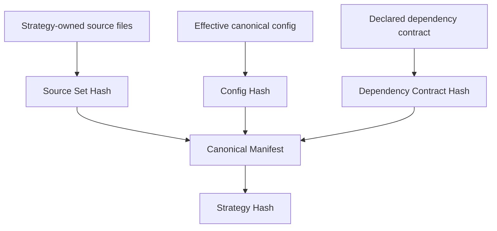
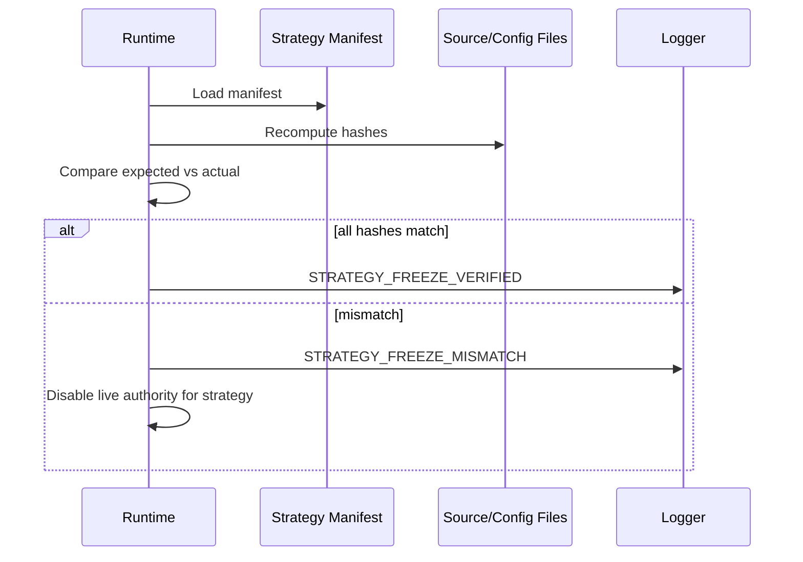
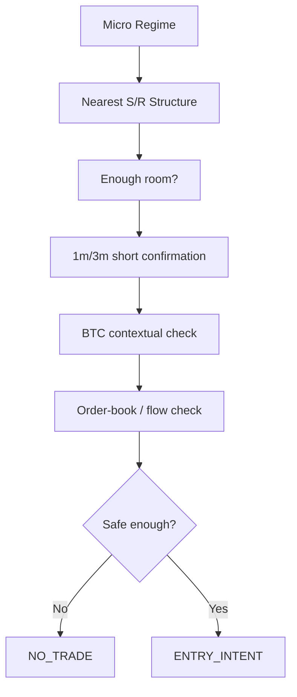

# Strategy Behavior & Hash Freeze Contracts

> **Status:** DESIGN / NO RUNTIME AUTHORITY  
> **Branch:** `work/micro-burst-rider-v1-20260826`  
> **Purpose:** define how each strategy behaves, what it owns, what it may share, and how an immutable strategy revision will be frozen and identified.

This document is intentionally separate from the general runtime architecture. The architecture describes **how the bot is organized**. This file describes **what each strategy is allowed to do** and how that behavior becomes reproducible through versioned hashes.

No strategy is frozen merely because it appears in this document. A strategy becomes frozen only after a canonical manifest exists, all referenced source/config artifacts are finalized, the required hashes are computed, and the resulting contract is committed.

---

## 1. Strategy contract principles

Every live-capable strategy must have a complete contract covering:

1. identity;
2. data inputs;
3. entry hypothesis;
4. regime interpretation;
5. hard-safety dependencies;
6. position sizing authority;
7. bracket policy;
8. open-position lifecycle;
9. exit authority;
10. maximum holding behavior;
11. state/restart behavior;
12. telemetry;
13. frozen source/config artifacts;
14. canonical hashes.

A strategy may reuse a **mechanism** without reusing another strategy's **decision policy**.

Example:

```text
safeMoveCloseStop()     = mechanism, can be shared
"move to BE at +8% ROE" = policy, belongs to a strategy contract
```

---

## 2. Canonical strategy identity

Target runtime identity:

```ts
interface StrategyIdentity {
  strategyId: string;
  strategyVersion: string;
  strategyHash: string;
  configHash: string;
  codeCommitSha: string;
}
```

### Required semantics

`strategyId`
: stable family identifier, e.g. `AEGIS_TURBO`, `MOMENTUM_RIDE`, `MICRO_BURST_V1`.

`strategyVersion`
: human-readable immutable revision label, e.g. `1.0.0-frozen-2026-09-01`.

`strategyHash`
: SHA-256 fingerprint of the canonical strategy manifest and all strategy-owned frozen artifacts.

`configHash`
: SHA-256 fingerprint of the canonical effective strategy configuration after deterministic normalization.

`codeCommitSha`
: repository commit SHA containing the exact implementation used.

A runtime event with an unknown, missing, or mismatched required strategy hash must not claim to be a frozen-strategy trade.

---

## 3. Freeze states

Each strategy revision must explicitly be one of:

```text
DRAFT
SHADOW_CANDIDATE
FROZEN_SHADOW
FROZEN_LIVE_CANDIDATE
FROZEN_LIVE
RETIRED
INVALIDATED
```

Meaning:

- `DRAFT`: behavior can change freely; no evidence authority.
- `SHADOW_CANDIDATE`: structurally ready for observation but not frozen.
- `FROZEN_SHADOW`: exact behavior frozen for prospective shadow evidence.
- `FROZEN_LIVE_CANDIDATE`: shadow evidence passed predefined gates, but live still requires explicit promotion.
- `FROZEN_LIVE`: exact frozen revision allowed to trade under approved configuration.
- `RETIRED`: preserved for history but no new authority.
- `INVALIDATED`: contract/evidence found defective; no authority.

Live promotion never changes the strategy hash. If behavior changes, it is a new strategy revision and therefore a new hash.

---

## 4. Canonical manifest

Each frozen revision should eventually have a machine-readable manifest such as:

```text
strategy-contracts/
└── micro-burst-v1/
    └── 1.0.0/
        ├── manifest.json
        ├── config.canonical.json
        ├── checksums.sha256
        └── README.md
```

Proposed `manifest.json` schema:

```json
{
  "schema": "strategy-freeze-contract-v1",
  "strategy_id": "MICRO_BURST_V1",
  "strategy_version": "1.0.0",
  "freeze_state": "FROZEN_SHADOW",
  "source_commit_sha": "<git-sha>",
  "entry_owner": "MICRO_BURST_V1",
  "position_manager_owner": "MICRO_BURST_V1",
  "execution_core_version": "<version>",
  "hard_safety_contract_version": "<version>",
  "source_files": [],
  "config_files": [],
  "data_contracts": [],
  "runtime_dependencies": [],
  "forbidden_dependencies": [],
  "canonical_config_sha256": "<sha256>",
  "strategy_sha256": "<sha256>",
  "created_at_utc": "<timestamp>"
}
```

---

## 5. Canonical hashing algorithm

The hash contract must be deterministic across machines.

### 5.1 File normalization

For strategy-owned textual artifacts included in the hash:

1. decode as UTF-8;
2. normalize line endings to `\n`;
3. reject invalid UTF-8;
4. do **not** trim meaningful whitespace inside lines;
5. ensure exactly one terminal newline;
6. sort files lexicographically by repository-relative path.

Generated logs, timestamps, node_modules, build artifacts, runtime state, and secrets must never be part of a strategy hash.

### 5.2 Canonical configuration

The effective strategy configuration is resolved first, then encoded as canonical JSON:

- UTF-8;
- object keys recursively sorted lexicographically;
- arrays preserve semantic order;
- numbers serialized without locale formatting;
- no comments;
- no insignificant whitespace;
- secrets omitted and replaced only by non-secret identity metadata when necessary.

Then:

```text
configHash = SHA256(canonicalConfigBytes)
```

### 5.3 Strategy hash input

For each strategy-owned file:

```text
FILE <repo-relative-path>\n
SHA256 <file-sha256>\n
```

The canonical manifest excluding its own `strategy_sha256` field is serialized canonically and appended.

Conceptually:

```text
strategyHash = SHA256(
    canonical_manifest_without_strategy_hash
    + ordered_file_hash_records
    + canonical_config_hash
)
```

The implementation must later have deterministic tests with known fixtures.

---

## 6. Hash hierarchy

We should distinguish several hashes rather than using one ambiguous value:



Recommended fields:

```text
source_set_sha256
config_sha256
dependency_contract_sha256
strategy_sha256
```

This lets us distinguish:

- code changed;
- thresholds changed;
- dependencies changed;
- complete strategy contract changed.

---

## 7. Runtime hash verification

A future frozen runtime should perform verification at startup.



For a strategy configured as frozen/live, a hash mismatch should fail closed for that strategy.

Shadow calculation may optionally continue only if explicitly configured as an unfrozen development run and clearly labeled as such.

---

## 8. Shared execution-core contract

A strategy hash should not need to absorb the entire repository. Instead, strategy manifests declare the shared runtime contract versions they depend on.

Example:

```json
{
  "execution_core": "execution-core-v2",
  "hard_safety": "hard-safety-v1",
  "market_data": "market-data-contract-v1"
}
```

If shared execution semantics materially change, the dependency contract hash changes and frozen strategies require re-verification before live authority.

Examples of material shared changes:

- order type semantics;
- quantity rounding behavior;
- bracket failure handling;
- position verification logic;
- safe stop replacement semantics;
- ownership recovery rules;
- leverage/margin-mode behavior.

Formatting-only or logging-only changes need not invalidate a strategy if they do not alter a declared behavioral contract.

---

# STRATEGY CONTRACTS

---

## 9. AEGIS_TURBO

### Current role

Aegis Turbo is the existing Aegis-owned strategy path. It may use the Python/current-brain signal and Aegis-specific entry-policy machinery.

### Target ownership

```text
Entry hypothesis owner:       AEGIS_TURBO
Entry policy owner:           AEGIS_TURBO
Position lifecycle owner:     AEGIS_TURBO
Trade attribution:            AEGIS_TURBO
```

### Strategy-specific dependencies

Potential Aegis-owned policy dependencies include:

- current brain canonical decision;
- Aegis entry policy;
- EntryQuality;
- EventRisk;
- DecisionBrain enforcement;
- CleanEntry;
- Aegis regime interpretation;
- E4 tail-risk veto where configured;
- Aegis ProfitGuardian policy;
- Aegis Exit Eye policy;
- Aegis trailing/break-even policy.

These are **not automatically inherited** by other strategies.

### Shared mechanisms it may use

- Binance exchange adapter;
- symbol filters;
- order sizing mechanisms;
- position verification;
- protective bracket placement;
- safe stop replacement;
- emergency close;
- generic account-level hard safety;
- state persistence and telemetry.

### Freeze status in this document

```text
STRATEGY_ID: AEGIS_TURBO
FREEZE_STATUS: UNFROZEN_BY_THIS_CONTRACT
STRATEGY_HASH: NOT_ASSIGNED
```

This document does not retroactively declare existing Aegis behavior frozen.

---

## 10. MOMENTUM_RIDE

### Current branch behavior

The parent branch includes standalone main momentum replication. `MainStackingMomentumStrategy` can detect a pattern from completed 5m candles using deterministic technical rules such as:

- recent candle direction;
- volume threshold and progression;
- body fraction;
- wickiness;
- EMA 7/25/99 trend alignment;
- extension from EMA25;
- ATR percentage.

The standalone mode may suppress Aegis fallback when no momentum pattern exists.

### Architectural problem to resolve

The current implementation can create a momentum candidate and then reuse Aegis-oriented downstream structures. Future architecture should preserve the momentum hypothesis while removing accidental Aegis ownership from its lifecycle and metrics.

### Target ownership

```text
Entry hypothesis owner:       MOMENTUM_RIDE
Entry policy owner:           MOMENTUM_RIDE
Position lifecycle owner:     MOMENTUM_RIDE
Trade attribution:            MOMENTUM_RIDE
```

### Aegis dependencies

Target rule:

- Aegis-specific guards are not inherited unless a Momentum contract explicitly declares one as a dependency.
- If a shared safety concept is desired, it should be extracted into the shared safety plane rather than invoked through a fake Aegis signal.

### Freeze status in this document

```text
STRATEGY_ID: MOMENTUM_RIDE
CURRENT_KNOWN_AUTHORITY_REFERENCE: origin/main@3a6dbc330760aa8bf179be76c413623d7d50a420
FREEZE_STATUS: UNFROZEN_BY_THIS_CONTRACT
STRATEGY_HASH: NOT_ASSIGNED
```

The existing `MAIN_STACKING_MOMENTUM_AUTHORITY` reference is provenance, not yet the complete canonical freeze hash defined here.

---

## 11. MICRO_BURST_V1

### Objective

Micro Burst V1 is a deterministic, short-horizon strategy intended to exploit movement between nearby structural levels while abandoning the trade quickly when the original hypothesis stops behaving normally.

It is not initially an ML strategy.

Its target behavior is:

> **Find a short-lived favorable path, confirm quickly, enter with explicit structural room, require the trade to prove itself early, let healthy movement continue, and exit aggressively when health deteriorates or the expected path becomes abnormal.**

### Timeframes

Primary intended inputs:

```text
1m = micro confirmation / immediate behavior
3m = local structure / short trajectory
5m = regime / structural context
```

BTC may be used as contextual confirmation/veto.

Order-book and taker-flow data may be used as short-horizon confirmation/veto once implemented and validated.

### Entry families

Initial conceptual families:

```text
LONG_FROM_SUPPORT
LONG_TO_RESISTANCE
SHORT_FROM_RESISTANCE
SHORT_TO_SUPPORT
NO_TRADE
```

These names describe the intended path relative to nearby structure. Exact rules are not frozen yet.

### Intended entry pipeline



A confirmation component may veto or permit a candidate. No single noisy order-book snapshot should initially create an entry by itself.

### Position lifecycle

Micro Burst owns a separate `TradeHealth` concept.

Possible health dimensions to research:

- directional progress after entry;
- time to first favorable excursion;
- path efficiency;
- candle overlap;
- body contraction/expansion;
- opposing wick pressure;
- short-horizon acceleration/deceleration;
- taker-flow deterioration;
- order-book imbalance reversal;
- liquidity replenishment/absorption;
- BTC contradiction;
- local structure reclaim/break;
- distance remaining to destination;
- volatility shock.

These are research dimensions, not frozen thresholds.

### Desired decisions

```text
HOLD
PROTECT
EXIT_NOW
DESTINATION_REACHED
HARD_INVALIDATION
MAX_HOLD_EXIT
```

### Time-to-prove principle

The strategy is explicitly allowed to conclude:

> The entry thesis was a short-horizon thesis; lack of timely favorable progress is evidence that the thesis is weakening.

Therefore a Micro Burst trade should not become an hours-long passive position merely because a distant hard stop has not been reached.

Exact time thresholds require evidence and are currently **UNFROZEN**.

### Bracket contract

Micro Burst should normally require an exchange-resident hard protective stop immediately after entry.

This stop is primarily disaster/structural protection. Active TradeHealth may exit much earlier.

A destination TP may be used, but whether it is mandatory is still an architectural decision.

### Legacy policy isolation

Unless explicitly added to a frozen Micro Burst manifest, these are forbidden strategy dependencies:

```text
Aegis DecisionBrain
Aegis EntryQuality policy
Aegis CleanEntry policy
Aegis MomentumRide policy
Aegis ProfitGuardian thresholds
Aegis Exit Eye decisions
Aegis-specific trailing activation rules
Python brain signal
```

Shared low-level mechanisms remain reusable.

### Initial position concurrency contract

For V1 research, desired default:

```text
MAX_OPEN_MICRO_BURST_POSITIONS_GLOBAL = 1
```

No pyramiding, no averaging down/up, no simultaneous second Micro Burst position, and no immediate side flip while an exit is unresolved.

### Leverage

30x–50x is an experimental goal, **not a frozen default**.

Leverage does not replace risk sizing or the hard stop. Final leverage rules must be separately validated and frozen.

### Freeze status

```text
STRATEGY_ID: MICRO_BURST_V1
FREEZE_STATUS: DRAFT
STRATEGY_HASH: NOT_ASSIGNED
CONFIG_HASH: NOT_ASSIGNED
LIVE_AUTHORITY: FALSE
```

---

## 12. Strategy isolation matrix

Target policy:

| Capability / Policy    |    AEGIS_TURBO |    MOMENTUM_RIDE | MICRO_BURST_V1 |                        Shared Core |
| ---------------------- | -------------: | ---------------: | -------------: | ---------------------------------: |
| Python/current brain   | Strategy-owned |    No by default |             No |                                 No |
| Aegis Entry Policy     | Strategy-owned |    No by default |             No |                                 No |
| Momentum detector      |             No |   Strategy-owned |             No |                                 No |
| Micro regime/SR        |             No |               No | Strategy-owned |                                 No |
| Micro TradeHealth      |             No |               No | Strategy-owned |                                 No |
| E4 tail risk           | Aegis contract |    Not inherited |  Not inherited | Only if later extracted explicitly |
| Daily loss stop        |           Uses |             Uses |           Uses |                                Yes |
| Position ownership     |           Uses |             Uses |           Uses |                                Yes |
| Symbol filters         |           Uses |             Uses |           Uses |                                Yes |
| Market order mechanism |           Uses |             Uses |           Uses |                                Yes |
| Hard bracket mechanism |           Uses |             Uses |           Uses |                                Yes |
| Safe stop replacement  |           Uses |             Uses |           Uses |                                Yes |
| Emergency close        |           Uses |             Uses |           Uses |                                Yes |
| ProfitGuardian policy  | Strategy-owned | Only if declared |  No by default |                                 No |
| Exit Eye policy        | Strategy-owned | Only if declared |             No |                                 No |
| Trade logging          |           Uses |             Uses |           Uses |                                Yes |

---

## 13. Forbidden cross-strategy behavior

The following must be considered architectural defects unless explicitly declared in a freeze contract:

```text
1. Strategy A forges Strategy B's signal structure to gain execution authority.
2. Strategy A's trade is stored as Strategy B in close history.
3. A position manager acts on a trade whose strategyId it does not own.
4. A strategy-specific guard blocks another strategy without a declared dependency.
5. A strategy-specific trailing rule mutates another strategy's stop.
6. Runtime restart assigns ownership from side/symbol instead of persisted identity.
7. Live configuration changes strategy behavior without changing configHash.
8. Frozen strategy code changes while strategyHash remains unchanged.
```

---

## 14. Strategy decision envelope

Eventually all strategies should produce a normalized envelope without losing their internal semantics.

Proposed interface:

```ts
interface StrategyDecisionEnvelope {
  identity: StrategyIdentity;
  mode: 'OFF' | 'SHADOW' | 'LIVE';
  symbol: string;
  timestamp: number;
  decision: 'NO_TRADE' | 'ENTRY_INTENT';
  side?: 'LONG' | 'SHORT';
  reason: string;
  confidence?: number;
  structuralInvalidation?: number;
  destinationPrice?: number;
  requestedRisk?: number;
  diagnostics: Record<string, unknown>;
}
```

`confidence` is optional because deterministic strategies need not pretend to output calibrated probabilities.

---

## 15. Position lifecycle envelope

Proposed normalized result:

```ts
interface PositionLifecycleDecision {
  identity: StrategyIdentity;
  tradeId: string;
  decision: 'HOLD' | 'MOVE_STOP' | 'CLOSE_MARKET' | 'NO_ACTION';
  reason: string;
  requestedStopPrice?: number;
  diagnostics: Record<string, unknown>;
}
```

The strategy requests an action. The execution core validates operational safety and executes it.

This prevents strategy modules from directly manipulating Binance orders.

---

## 16. Config changes and hash invalidation

A strategy revision must get a new config hash when any behaviorally meaningful setting changes, including examples such as:

- entry threshold;
- timeframe;
- enabled side;
- regime rule;
- S/R lookback;
- minimum room;
- confirmation threshold;
- order-book threshold;
- maximum hold;
- TradeHealth threshold;
- hard-stop rule;
- destination behavior;
- leverage rule;
- position risk rule;
- cooldown;
- strategy-specific BTC veto.

Operational settings that may be excluded only if proven behavior-neutral should be explicitly listed in the manifest.

---

## 17. Research-to-live promotion contract

A strategy should move through an explicit chain:


No same-run threshold tuning followed by live promotion under the same strategy hash.

If behavior changes after looking at outcomes:

```text
new behavior -> new version -> new hash -> new prospective evidence
```

---

## 18. Evidence attribution requirement

All performance reports must group by at least:

```text
strategy_id
strategy_version
strategy_hash
config_hash
```

Mixing trades from different hashes into one headline result without stratification is prohibited for strategy validation.

This is particularly important when the same strategy name survives several experimental revisions.

---

## 19. Hash mismatch incident behavior

If a live-frozen strategy is configured but its runtime hash does not match:

```text
DO NOT OPEN NEW POSITIONS
```

Existing positions must not be abandoned. They should enter a defined safe-recovery lifecycle using persisted strategy identity and exchange protection.

Minimum telemetry:

```text
STRATEGY_HASH_MISMATCH
expected_strategy_hash
actual_strategy_hash
expected_config_hash
actual_config_hash
strategy_id
strategy_version
code_commit_sha
live_entry_authority=false
```

---

## 20. Initial contracts still requiring discussion

Before code refactoring, the following decisions remain intentionally open:

1. Should `E4` remain exclusively part of Aegis Turbo or become an optional shared tail-risk service with separate declared contracts?
2. Should the single-position lock apply globally across all strategies during the Micro Burst experiment or only within Micro Burst?
3. Should Momentum Ride get its own independent position manager immediately or retain legacy management temporarily behind an explicit compatibility contract?
4. Which account-level guards are mandatory for every strategy?
5. Is destination TP mandatory for Micro Burst or is hard SL the only required exchange-resident bracket?
6. What exact order-book stream/depth contract will Micro Burst use?
7. How will 3m candles be constructed and timestamped deterministically?
8. Which effective-config fields are behavioral and therefore included in `configHash`?
9. Should strategy hashes be generated by a repository CLI, CI, or both?
10. What is the exact recovery policy when code/config hashes mismatch while a position is already open?

These questions must be resolved before any strategy is declared frozen.

---

## 21. Documentation-phase guarantee

At the time this document is introduced:

```text
RUNTIME_CODE_CHANGED = FALSE
LIVE_CONFIG_CHANGED = FALSE
FILES_MOVED = FALSE
FILES_DELETED = FALSE
MICRO_BURST_IMPLEMENTED = FALSE
MICRO_BURST_LIVE_AUTHORITY = FALSE
STRATEGY_HASHES_FROZEN = FALSE
```

The only purpose of this phase is to establish a reviewable architectural and strategy-contract foundation before changing the codebase.
