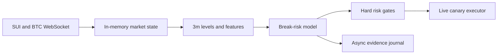

# SUI Support/Resistance Scout — Live Canary Experiment

## 1. Purpose

Build a small, isolated, low-latency Binance USD-M futures runtime that watches
only `SUIUSDT` and `BTCUSDT`.

- `SUIUSDT` is the only trade candidate.
- `BTCUSDT` is market context only and must never be traded by this runtime.
- The experiment starts with live market data and is designed to support a
  deliberately small, user-enabled live-canary position from day one.
- Its purpose is **not** to predict every price move. Its purpose is to decide
  whether a 3-minute support/resistance setup is safe enough to trade, likely
  to break, or too ambiguous to touch.

The manual pattern that motivated this work is: identify an apparent 3-minute
support or resistance, trade the expected rejection, then get stopped when the
level breaks and continues. The Scout must specifically reduce those
counter-trend rejection trades during genuine breakouts.

## 2. Scope and non-goals

This is a new runtime, not another layer inside the 11-symbol bot. It must not
start, subscribe, evaluate, or execute Aegis, Momentum Ride, MicroBurst, or
any legacy strategy. Their source code remains unchanged and reusable.

Non-goals for the first implementation:

- no automated leverage selection;
- no trading of BTC, ADA, ETH, or any symbol other than SUI;
- no REST polling in the order-decision hot path;
- no Python process, HTTP model service, database write, Telegram request, or
  synchronous disk write in the hot path;
- no modification to PM2, production processes, credentials, or existing bot
  configuration;
- no claim that an ML score is certainty.

The branch is an experiment. It must be independently runnable and independently
stoppable.

## 3. Decision contract

At every candidate SUI level event the strategy must emit one of these mutually
exclusive decisions:

| Decision | Meaning | Order action |
| --- | --- | --- |
| `ALLOW_REJECTION_LONG` | Support is holding and a long rejection has sufficient edge. | May create a long intent in live-canary mode. |
| `ALLOW_REJECTION_SHORT` | Resistance is holding and a short rejection has sufficient edge. | May create a short intent in live-canary mode. |
| `WAIT_BREAKOUT_PULLBACK` | The level is breaking; do not fade it. Observe for a later retest. | No immediate order. |
| `BLOCK_BREAKOUT_RISK` | Momentum/context makes a fade dangerous. | No order. |
| `NO_TRADE` | Insufficient data, weak edge, stale feed, cooldown, or ambiguous state. | No order. |

The system must favour `NO_TRADE`. It must never open a position merely because
price is close to a level.

## 4. Runtime architecture

Create a dedicated entrypoint and modules under a clear namespace, for example:

```text
src/scouts/sui-sr-scout/
  main.ts                         # dedicated process entrypoint
  config/SuiSrScoutConfig.ts       # strict config parsing and safe defaults
  market/ScoutMarketDataRuntime.ts # WebSocket subscriptions and state cache
  market/ThreeMinuteCandleBuilder.ts
  domain/LevelDetector.ts          # support/resistance zones
  domain/FeatureVector.ts
  domain/BreakRiskPolicy.ts        # deterministic baseline gate
  domain/DecisionPolicy.ts
  domain/RiskPolicy.ts
  application/ScoutCoordinator.ts
  application/LiveCanaryExecutor.ts
  application/AsyncEvidenceJournal.ts
  ml/ModelArtifact.ts              # local-only inference contract
  ml/RuleBaselineModel.ts          # first model implementation
  research/TrainingDatasetWriter.ts
```

Names may differ if the repository conventions suggest a better placement, but
the runtime must remain isolated from `TradingService` and the existing strategy
routers. Reuse existing typed exchange, WebSocket, order, logging, and risk
interfaces where this does not pull the 11-symbol orchestration into the new
process.



## 5. Market data and latency requirements

Subscribe only to the smallest set of streams needed for SUI and BTC:

- aggregate trades;
- incremental depth / partial depth at 100 ms for SUI, and a lightweight depth
  view for BTC;
- mark price / funding stream if the current exchange adapter supports it;
- kline streams may be used for reconciliation, but build the authoritative
  1-minute and 3-minute state locally from ordered event time.

The state must retain bounded ring buffers only. Suggested initial windows:

- SUI: 1m candles (240), 3m candles (240), 5m derived candles (96), aggregate
  trade buckets (last 15 minutes), depth snapshots/deltas (last 60 seconds);
- BTC: 1m candles (120), 3m candles (120), aggregate trade buckets (last
  10 minutes), depth imbalance (last 60 seconds).

All event handlers must record exchange time and local receipt time. A stale,
gapped, out-of-order, or unsynchronised feed is a hard `NO_TRADE` condition.
The executor must use current in-memory state; it must not fetch candles or a
book snapshot before sending an order.

## 6. 3-minute support/resistance detector

The detector should produce zones, not single magic prices.

1. Find confirmed pivot highs and lows on closed 3-minute candles.
2. Cluster pivots that lie within a volatility-normalised tolerance, initially
   `max(2 ticks, 0.15 * ATR(14, 3m))` and configurable.
3. Score a zone by touch count, recency, rejection magnitude, traded volume,
   time spent at the level, and whether it was already cleanly broken.
4. Mark the nearest active support and resistance, including zone bounds and
   distance in ATR/ticks.
5. Emit a candidate only on an approach, touch, reclaim, or retest event. Do
   not repeatedly emit the same level every tick.

The detector must distinguish a resistance test from a price that has already
accepted above resistance. Repeated closes near/above a resistance, increasing
volume, and rising open interest are breakout evidence, not a short signal.

## 7. Feature vector

Create one versioned, serializable feature vector per candidate event. Missing
or stale features are explicit and cause `NO_TRADE`; never silently substitute
future data or zero values.

### Level geometry

- side, zone bounds, width, score, touch count, age, and time since last touch;
- distance to zone in ticks and ATR units;
- current 3m candle body/wick ratios and close location;
- compression / range contraction before the touch;
- reclaim or acceptance beyond the zone;
- local support/resistance distance and room to the proposed target.

### SUI price, volatility, and momentum

- 1m, 3m, and 5m returns; realised volatility; ATR; range percentile;
- EMA slope and distance; RSI only as an extension feature, never a standalone
  entry signal;
- volume relative to rolling median; volume acceleration;
- candle sequence, higher-high/lower-low structure, and momentum acceleration.

### Order flow and book

- taker buy/sell ratio over 5s, 30s, 1m, and 3m;
- signed trade notional, trade intensity, and consecutive aggressive flow;
- spread, top-of-book imbalance, multi-level imbalance, imbalance change, and
  best bid/ask depletion;
- visible liquidity absorption at the active zone.

The book is evidence, not truth: resting orders may be cancelled or spoofed.
Use changes and executed flow rather than a single depth snapshot.

### Futures positioning and market context

- funding, basis if available, and periodic open-interest change; these may be
  background features but must carry their freshness timestamp;
- BTC 1m/3m momentum, realised volatility, taker imbalance, range expansion,
  and direction relative to the proposed SUI trade;
- SUI/BTC short-window relative return and correlation.

`BTC_AGGRESSIVE_AGAINST_TRADE` is a hard block: for example, a proposed SUI
short cannot be opened when BTC has a strong upward range expansion plus
aggressive buying; symmetric logic applies to SUI longs.

## 8. Baseline policy before ML

Implement a deterministic and fully tested baseline first. It is the control
group and must keep running even after an ML artifact is available.

A rejection is eligible only when all conditions hold:

1. the level score and market-data freshness pass;
2. price touched the zone but has not accepted through it;
3. a 1m/3m rejection or reclaim pattern is present;
4. SUI taker flow is not materially against the trade;
5. BTC is not aggressive against the trade;
6. enough room exists to target before the next opposing zone;
7. projected reward after fee and slippage assumptions is greater than the
   configured minimum R multiple;
8. no cooldown, daily loss, position, or feed-health gate blocks it.

The breakout-risk policy must block a fade when price/OI/volume expansion,
acceptance beyond the zone, and aligned SUI/BTC flow support continuation.

## 9. ML plan

Do not begin with a neural network or a black-box directional model. Train a
calibrated, auditable tabular classifier offline, initially LightGBM/XGBoost or
logistic regression. Training is Python/offline; inference is local and
in-process in TypeScript through a compact exported artifact (JSON trees, ONNX,
or an equivalent dependency with deterministic tests). Python must never sit in
the live order path.

### Labels

For each historical candidate level event, define a structural stop and target
that were known at event time. Label which happened first within a fixed
time-horizon:

- `REJECTION_SUCCESS`: target before stop;
- `BREAKOUT_FAILURE`: stop/acceptance beyond level before target;
- `TIMEOUT_OR_NO_EDGE`: neither outcome before horizon;
- optional directional breakout labels for research.

Store MFE, MAE, time-to-outcome, fees, estimated slippage, and resulting net R.
Never label from a discretionary manual exit. Every label must be reproducible
from immutable event data and configuration version.

### Evaluation

- chronological, purged walk-forward splits only; never random train/test
  splitting;
- train and validate SUI first; do not pool ADA until a separate analysis
  demonstrates it is valid;
- compare the baseline against `baseline + model` and against abstention;
- require improvement in net expectancy after conservative costs across several
  non-overlapping periods, not merely a higher win rate;
- record calibration, precision at the live threshold, coverage, max drawdown,
  adverse excursion, and regime-by-regime stability.

The live model may only return calibrated probabilities plus an artifact ID and
feature schema version. `DecisionPolicy` retains ownership of final gating and
risk.

## 10. Live-canary execution

This experiment is intended to use live Binance market data and may use a very
small real-capital canary from day one once explicitly enabled by its owner.
Live capability must be deliberately configured, never implicit.

Required configuration contract (names may follow repository conventions):

```text
SUI_SR_SCOUT_ENABLED=false
SUI_SR_SCOUT_EXECUTION_MODE=OBSERVE        # OBSERVE | LIVE_CANARY
SUI_SR_SCOUT_LIVE_ENABLED=false            # must be true for real orders
SUI_SR_SCOUT_SYMBOL=SUIUSDT
SUI_SR_SCOUT_CONTEXT_SYMBOL=BTCUSDT
SUI_SR_SCOUT_MAX_OPEN_POSITIONS=1
SUI_SR_SCOUT_MAX_QUOTE_NOTIONAL=<owner supplied>
SUI_SR_SCOUT_MAX_LEVERAGE=<owner supplied>
SUI_SR_SCOUT_MAX_RISK_PER_TRADE_BPS=<owner supplied>
SUI_SR_SCOUT_MAX_DAILY_LOSS_BPS=<owner supplied>
SUI_SR_SCOUT_COOLDOWN_AFTER_STOP_MS=<owner supplied>
```

Defaults must be disabled/fail-closed. The code must reject `LIVE_CANARY` unless
all required limits are positive, a live enable flag is explicitly true, the
symbol is exactly SUI, and data health is green. Leverage must be configured by
the owner and is not a signal. A 40x setting does not relax any risk gate.

Each approved live order must have:

- a unique decision ID and feature/artifact provenance;
- exactly one SUI position maximum;
- a protective reduce-only stop submitted immediately or an atomic equivalent;
- a take-profit plan and a time stop;
- cancel/replace and recovery behaviour that cannot create duplicate orders;
- a daily loss stop, consecutive-loss cooldown, and manual kill switch;
- no averaging down, martingale, or reversal order without a new decision.

The system must never trade BTC. It must not trade if a position/order state is
unknown, exchange state cannot be reconciled, or stop protection cannot be
confirmed.

## 11. Evidence and observability

Write evidence asynchronously in JSONL (or an existing compatible journal):

- received market events and feed gaps;
- detected zones and candidate events;
- full feature vector plus schema version;
- baseline result, model score/artifact ID, final decision, and block reasons;
- intended stop/target/risk calculation;
- order lifecycle, fills, protective-order verification, and close reason;
- realised MFE/MAE/net result for every candidate, including blocked trades.

Expose a lightweight health/diagnostic view with: process state, two subscribed
symbols, event freshness, sequence gaps, active position/order state, model
artifact identity, decisions by outcome, and current kill-switch state.

## 12. Required tests and acceptance gates

Before any live-canary enablement, provide deterministic tests for:

1. exact universe is `[BTCUSDT, SUIUSDT]` and only SUI is tradeable;
2. existing strategies cannot start through the Scout entrypoint;
3. stale/gapped/out-of-order data produces `NO_TRADE`;
4. BTC aggressive-against-trade produces `BLOCK_BREAKOUT_RISK`;
5. breakout acceptance blocks a resistance/support fade;
6. valid rejection fixture produces the expected candidate decision;
7. `OBSERVE` cannot call the order port;
8. `LIVE_CANARY` rejects unsafe/missing configuration;
9. at-most-one-position and stop-protection failure are fail-closed;
10. feature schema/model artifact mismatch produces `NO_TRADE`.

Run formatting, TypeScript build, and the focused test suite. Add a short
operational README containing the exact observation command, the separately
explicit live-canary enablement command, and the stop/kill-switch command. Do
not start PM2 or send real orders as part of implementation.

## 13. Delivery sequence

Implement in small, reviewable commits:

1. isolated entrypoint, strict config, BTC/SUI WebSocket market state, and
   observation-only health/evidence;
2. 3m level detector, feature schema, deterministic baseline, and replay tests;
3. live-canary executor with fail-closed order protection and simulated tests;
4. dataset writer and offline training/evaluation tooling;
5. local artifact inference, shadow comparison, and promotion gates.

After each phase, report changed files, tests, remaining risks, and the exact
command needed to run it. Do not silently expand scope, enable other symbols,
or alter the existing production bot.
